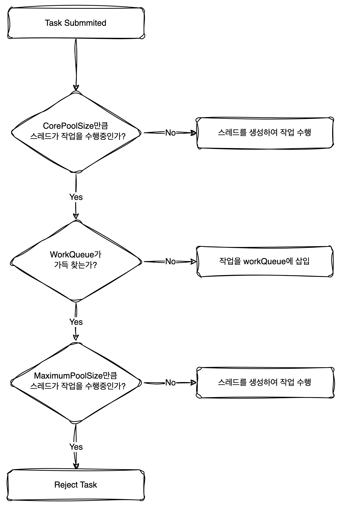

## 1. ThreadPoolExecutor

- `ThreadPoolExecutor`는 사용자가 작업을 제출하면 미리 생성된 스레드나 새로운 스레드를 생성하여 작업이 가능한 스레드가 해당 작업을 수행하는 역할을 한다.

### 1,1 ThreadPoolExecutor 사용 이유
1. 운영의 관점
- 미리 정해진 개수의 스레드를 생성하여 관리하기 때문에 상황에 따라서 시스템 자원을 효율적으로 사용할 수 있다.
  - 작업이 제출될때마다 스레드를 생성하는 것이 아니기 때문에 오버헤드를 감소시킬 수 있다.
  - 스레드를 관리하기 때문에 현재 제출받은 작업의 개수, 작업을 수행중인 스레드의 개수와 같은 통계도 확인할 수 있다.
- 사용자가 스레드를 직접 생성하고 삭제하지 않기 때문에 안정적으로 스레드를 운영할 수 있다.

2. 성능의 관점
- 정해진 스레드 수만큼 작업을 병렬적으로 수행할 수 있기 때문에 작업 처리량 속도가 높다.
- 정해진 수만큼 작업을 병렬적으로 수행하기 때문에 과도한 작업 요청으로 인한 성능 저하를 방지할 수 있다.

## 2. ThreadPoolExecutor API

### 작업 가능한 수

- `ThreadPoolExecutor` 클래스는 미리 정해진 수만큼 작업을 수행하게 되면 이를 초과할 시에는 작업을 거부하게 된다.
- 작업 수를 관리하는 변수
  - corePoolSize : 쓰레드 풀이 작업을 수행할 수 있는 최소한의 스레드 개수
  - workQueue : corePoolSize 만큼 작업을 수행중일 때, 스레드 풀에 작업이 제출되면 작업을 저장하는 용도로 사용된다.
  - maximumPoolSize : 쓰레드 풀이 생성할 수 있는 최대 스레드 개수
  
- 작업 수행 Flow

    

- ThreadPoolExecutor가 초기화되었을때 작업이 제출되면 corePoolSize만큼 스레드를 생성하게 된다.
- corePoolSize 만큼 작업을 수행중일 때, 작업에 제출되면 workQueue에 작업을 저장한다.
- woreQueue가 가득 차게되면 maximumPoolSize 만큼 작업을 스레드를 생성한다.
- woreQueue가 가득차고 maximumPoolSize 만큼 작업이 수행중이라면 이후 제출된 작업들은 거부된다.
  - ThreadPoolExecutor 내에서 작업을 수행할 수 있는 개수는 `maximumPoolSize + workQueue Size`이다.

- 큰 대기열과 작은 풀을 사용하면 오버헤드는 감소하지만 처리량 속도가 낮아질 수 있다.
- 반면에 작은 대기열과 큰 풀을 사용하면 처리량 속도는 높아질 수있지만 자원을 많이 소모하게 되며 작은 대기열때문에 작업이 거부될 수 있다.

