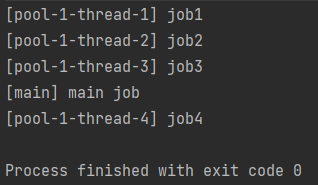
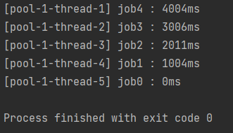
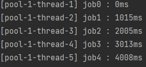

### ExecutorService
---

- `ExecutorService`를 이용하여 간단하게 쓰레드 풀 생성 및 병렬 처리(멀티 스레드)가  가능하다.
    - `newFiexdThreadPool(int)` : 인자 개수 만큼 고정된 쓰레드풀을 만든다.
    - `newCachedThreadPool()` : 필요할 때 필요한 만큼 쓰레드풀을 생성한다. 이미 생성된 쓰레드를 재활용한다.
    - `newScheduledThreadPool(int)` : 일정 시간 뒤에 실행되는 작업이나, 주기적으로 수행되는 작업이 있는 경우 활용할 수 있다.
    - `newSingleThreadExecutor()` : 싱글 쓰레드에서 동작해야 하는 작업을 처리할 때 활용할 수 있다.

- 4개의 고정된 쓰레드를 생성하여 작업
    ```java
        private static void runFixedThreadPool() throws InterruptedException {
            ExecutorService executor = Executors.newFixedThreadPool(4);

            executor.submit(() -> {
                printThreadName("job1");
            });

            executor.submit(() -> {
                printThreadName("job2");
            });

            executor.submit(() -> {
                printThreadName("job3");
            });

            executor.submit(() -> {
                printThreadName("job4");
            });

            printThreadName("main job");

            //더 이상 쓰레드풀에 작업을 추가하지 못하며, 처리 중인 Task가 모두 완료되면 쓰레드풀을 종료시킨다.
            executor.shutdown();

            //수행 중인 Task가 지정된 시간동안 끝나기를 기다린다. 만약 Task가 지정된 시간 내에에 끝나지 않으면 false를리턴
            if(!executor.awaitTermination(20, TimeUnit.SECONDS)){
                executor.shutdownNow();
            }
        }

        public static void printThreadName(String workName){
            System.out.println("[" + Thread.currentThread().getName() + "] " + workName);
        }
    ```

- 결과 
    
    
    - 멀티 쓰레드를 이용해 작업을 처리하는 것을 알 수 있다.   

<br/>

### Future
--- 


- `Future`를 이용하면 ExecutorService에서 작업한 결과값을 메인 쓰레드에서 얻을 수 있다.
    - ***쓰레드 작업이 완료되기를 기다리며, 결과값을 확인할 수 있다.***
    - 쓰레드 작업의 완료 여부, 취소 여부를 확인할 수 있다.
    
- Future를 이용해 다른 쓰레드에서 얻은 결과값 가져오기
    ```java
        private static void useFuture() throws InterruptedException, ExecutionException {
            final int maxCore = Runtime.getRuntime().availableProcessors();
            final ExecutorService executor = Executors.newFixedThreadPool(maxCore);
            final List<Future<String>> futures = new ArrayList<>();

            //다른 쓰레드의 결과값을 Future에 따로 저장
            for (int i = 0; i < 5; i++) {
                final int index = i;
                futures.add(executor.submit(() -> "[" + Thread.currentThread().getName() + "] " + "job" + index));
            }

            //Future를 이용해 결과 값 가져오기
            for (Future<String> future : futures) {
                String result = future.get();
                System.out.println(result);
            }

            executor.shutdownNow();
        }

    ```

- 문제점
    - 작업이 완료되기를 기다리면 결과값을 가져오기 때문에, ***이전 작업이 늦어지면 다른 작업의 결과값을 가져오는 시간이 오래 걸리 수 있다.***
- 작업이 늦어지는 경우
    ```java
    private static void useFutureWhenDelayTask() throws InterruptedException, ExecutionException {
        //...

        for (int i = 4; i >= 0; i--) {
            final int index = i;
            futures.add(executor.submit(() -> {
                long startTime = System.currentTimeMillis();
                Thread.sleep(1000 * index);
                long endTime = System.currentTimeMillis();
                return "[" + Thread.currentThread().getName() + "] job" + index + " : " + (endTime - startTime) + "ms";
            }));
        }
        //...
    }
    ```
- 결과

    
    - Future는 결과값을 얻을 때 동기적으로 수행하기 때문에 이러한 현상이 발생한다.

<br/>

### BlockingQueue
---

- 작업이 완료된 순으로 결과값을 가져올 수 잇다.
    - Future에서 값을 가지고 올 때 작업이 완료되지 않으면 기다리는 문제점을 해결할 수 있다.
- Thread-Safe하게 구현되어 있기 때문에 동시성을 보장해준다.

- 멀티 스레드 환경에서 작업이 완료된 순으로 결과값을 가져오는지 확인

    ```java
        public static void runParallelExecutorServiceWhenDelayTask(){

            int maxCore = Runtime.getRuntime().availableProcessors();
            ExecutorService executorService = Executors.newFixedThreadPool(maxCore);
            BlockingQueue<String> queue = new ArrayBlockingQueue<>(10);

            //작업이 초반에 딜레이되게끔 Thread Sleep
            //Queue에서 작업을 put
            for (int i = 0; i < 5; i++) {
                final int index = i;
                executorService.submit(() -> {
                    try {
                        long startTime = System.currentTimeMillis();
                        Thread.sleep(1000 * index);
                        long endTime = System.currentTimeMillis();
                        queue.put("[" + Thread.currentThread().getName() + "] job" + index + " : " + (endTime - startTime) + "ms");

                    } catch (InterruptedException e) {
                        Thread.currentThread().interrupt();
                    }
                });
            }

            //Queue에서 결과물 가져오기
            for (int i = 0; i < 5; i++) {
                try {
                    System.out.println(queue.take());
                } catch (InterruptedException e) {
                    Thread.currentThread().interrupt();
                    throw new IllegalStateException(e);
                }
            }

            List<Runnable> unfinishedWorks = executorService.shutdownNow();
            if(!unfinishedWorks.isEmpty()){
                System.out.println("Not all tasks finished before calling close: " + unfinishedWorks.size());
            }

        }

    ```

- 결과

    
    - 작업이 완료된 순으로 결과값는 것을 확인할 수 있다.

> **Reference**
> - [Funture Reference](https://docs.oracle.com/javase/7/docs/api/java/util/concurrent/Future.html)
> - [Java - ExecutorService를 사용하는 방법
](https://codechacha.com/ko/java-executors/)
> - [java에서의 비동기 프로그래밍](https://velog.io/@pllap/Java%EC%97%90%EC%84%9C%EC%9D%98-%EB%B9%84%EB%8F%99%EA%B8%B0-%ED%94%84%EB%A1%9C%EA%B7%B8%EB%9E%98%EB%B0%8D)
