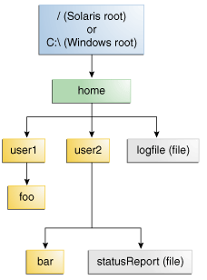

## java.nio.files

- `java.nio`는 `New I/O`의 약자로 기존 `java.io`에서 제공하는 Blocking 방식 스트림의 한계를 극복하고자 만들어졌다.
  > java.nio는 Non-Blocking I/O를 제공하며, 사용성이 높은 파일 시스템 API를 제공한다.
- 해당 문서의 목적은 `java.nio.files` 패키지를 기반으로 코드를 작성하기 때문에 만약 `java.nio`에 관심이 있다면 아래 공식 문서를 참고하는 것이 좋다.
  > [Java Docs > java.nio](https://docs.oracle.com/en/java/javase/22/docs/api/java.base/java/nio/package-summary.html)


## Path

- 현대의 파일 시스템은 파일을 트리(계층적) 구조로 저장하게 된다. 디렉터리 아래에는 파일과 하위 디렉토리가 포함되는 구조이다.



- 트리 구조에서 디렉터리 및 파일의 경로를 탐색거나 조작하기 위하여 Java에서는 Path 클래스를 제공한다.  
- Path 클래스를 다루는 경우 몇가지 주의할 점이 있다.
  - Path 객체를 생성했다고 파일 시스템 내부에 디렉터리나 파일이 무조건 존재한다는 것을 보장하지 않는다.
    - 새로운 디렉토리나 파일을 생성하기 위해서는 현재 파일시스템에 존재하지 않는 Path 객체를 생성해야하기 때문이다.
  - `new Path`와 같은 Path를 직접 생성하여 사용하는 것보다는, Path 인터페이스나 Paths 유틸클래스를 통하여 Path를 생성하는 것이 좋다.
    - 운영체제별 파일 경로를 추상화해두었기 때문에 `/` 경로 구분자만 사용하더라도 운영체제별로 호환이 된다. `Window: \, Unix: /`
  - Window 운영체제로 개발을 진행하는 경우 하드코딩된 드라이브 문자`(C:\\...)`보다는 상대경로나 시스템 속성을 활용하는 것이 좋다.
    - `System.getProperty("user.home")`

> [Path 예제](../src/main/java/org/example/io/fileio/path/PathMain1.java)

## Files

- File 클래스는 파일과 디렉토리의 정보를 얻어오가나 읽거나 쓰고 조작하기 위한 다양한 기능을 제공하는 클래스이다.
- I/O 스트림의 내에서 파일과 관련 스트림일 경우 파일에 데이터를 읽고 쓰는 작업에 주로 사용되지만 File 클래스는 파일의 생성, 삭제, 복사, Metadata 조회 등 다양한 기능을 제공한다.
  - 파일을 읽거나 쓸때에도 기존 I/O 스트림보다 사용하기 쉽다는 장점도 있다.

### 파일 및 디렉터리 생성

- File 클래스를 통해서 디렉터리와 파일의 생성이 가능하며, 임시 디렉터리 및 파일에 대한 생성도 가능하다.
- `(File/Files).createFile`
    - 파일을 생성하는 메서드
    - 파일이 이미 존재하는 경우 `FileAlreadyExistsException` 예외 발생
    - 상위 디렉터리가 존재하지 않는 경우 `NoSuchFileException` 예외 발생
    - 파일 생성 권한이 없는 경우 `SecurityException` 예외 발생
- `(File/Files).createDirectory`
    - 디렉터리를 생성하는 메서드이며 상위 디렉터리가 존재하지 않을 경우 상위 디렉터리 생성
    - 이며 디렉터리가 이미 존재하는 경우 `FileAlreadyExistsException` 예외 발생
    - 디렉터리 생성 권한이 없는 경우 `SecurityException` 예외 발생
- 임시 파일 및 디렉터리 생성
    - `(File/Files).createFile`과 `(File/Files).createDirectory` 메서드의 경우 주로 영구적인 파일 저장하고 활용하기 위해서 사용된다.
    - 데이터 저장소와 애플리케이션이 서로 네트워크를 통해서 데이터를 읽거나 쓸때 애플리케이션 서버 자체에 영구적으로 파일을 저장하는 경우가 많지 않다.
    - 그럼에도 불구하고 임시로 디렉터리 및 파일일 생성해서 활용하는 경우가 종종 발생한다.
        - 애플리케이션 성능 향상을 위한 캐싱 활용
        - 외부의 요청 또는 파일을 읽어서 처리하기 위한 임시 저장
        - 등등...
    - `(File/Files).createTempFile`과 `(File/Files).createTempDirectory`를 활용하여 사용자가 지정한 경로 또는 시스템 기본 임시 디렉터리에 임시 파일 및
      디렉터리를 생성할 수 있다.
    - suffix와 prefix를 인자값을 통해서 랜덤한 이름을 만들 수 있으며 거의 중복되지 않는다는 장점이 있다.
    - 임시 파일 및 디렉터리를 생성하였을 때 주의할 점은 ***자동으로 삭제되지 않는다는 점***이다. 이로 인하여 Disk 공간이 부족해지는 상황이 발생할 수 있기 때문에
      ***임시 파일 및 디렉터리를 생성한 이후에는 반드시 특정 시점에 삭제***해주어야 한다.
        - 파일 및 데렉토리를 생성한 이후 사용이 완료되었을 때 삭제
        - `deleteOnExit`나 `Shutdown Hook`을 이용한 JVM 종료 시 자동 삭제
        - 애플리케이션 내부 또는 외부에서 스케쥴링을 통한 주기적인 삭제

> [Create 예제](../src/main/java/org/example/io/fileio/file/CreateFileMain1.java)

### 파일 및 디렉터리 권한

- File 클래스는 파일 및 디렉터리의 권한을 설정할 수 있는 메서드를 제공하며 Posix File System의 Permission을 따른다.
  > 소유자 (Owner), 그룹 (Group), 기타 사용자 (Others) 세 가지 범주로 접근 권한을 관리를 하며 읽기 (Read - r), 쓰기 (Write - w), 실행 (Execute -x) 권한을
  설정할 수 있다.

| 권한           | 파일                                      | 디렉터리                                                                                                   |
|--------------|-----------------------------------------|--------------------------------------------------------------------------------------------------------|
| **`r` (읽기)** | 파일의 **내용을 읽거나 복사**할 수 있다.             | 디렉터리 내에 어떤 파일이나 하위 디렉터리가 있는지 그 **목록을 볼 수 있다.** (예: `ls` 명령). 단, 목록 내의 파일/디렉터리 내용 접근은 별개의 권한.       |
| **`w` (쓰기)** | 파일의 **내용을 수정하거나 덮어쓸 수 있다.**           | 디렉터리 내에 **파일이나 하위 디렉터리를 생성, 삭제, 또는 이름 변경**할 수 있다. (이 작업을 해당 디렉터리에 대한 `x` 권한도 함께 필요)              |
| **`x` (실행)** | 파일이 프로그램이나 스크립트인 경우, 이를 **실행**할 수 있다. | 디렉터리 내부로 **진입하거나 접근할 수 있다.** (예: `cd` 명령). |

- Files 유틸 클래스트를 통해서 파일 및 디렉터리의 생성 시점이나 생성된 파일의 권한을 수정할 수 있다.

```java
//파일 생성 시점에 권한 설정
Files.createFile(Path path, FileAttribute<?>... attrs);
Files.

createDirectories(Path dir, FileAttribute<?>... attrs);

//기존 파일 권한 수정
Files.

setPosixFilePermissions(Path path, Set<PosixFilePermission> perms)
```

> [Permission 예제](../src/main/java/org/example/io/fileio/file/PermissionFileMain1.java)

### 파일 및 디렉터리 복사 및 이동

- File 클래스는 파일 및 디렉터리를 복사 및 이동이 가능하며 CopyOption을 활용하여 어떻게 복사 및 이동을 할지를 결정할 수 있다.

> [Copy 예제](../src/main/java/org/example/io/fileio/file/CopyFileMain1.java) <br/>
> [Move 예제](../src/main/java/org/example/io/fileio/file/MoveFileMain1.java) <br/>

### 파일 및 디렉터리 삭제

- File 클래스는 파일 및 디렉터리를 삭제할 수 있다.

> [Delete 예제](../src/main/java/org/example/io/fileio/file/DeleteFileMain1.java) <br/>

### 파일 읽기 및 쓰기

- Files 유틸 클래스는 `java.io`내에 있는 스트림을 통한 읽기 및 쓰기를 제공해 줄뿐만 아니라 좀더 다양한 기능을 제공해준다.

> [Read Write 예제](../src/main/java/org/example/io/fileio/file/ReadOrWriteMain1.java) <br/>

### 파일 정보 확인

- Files 유틸 클래스를 통해서 파일 및 디렉터리 존재 여부 및 메타데이터의 정보를 확인할 수 있다.

> [Info 예제](../src/main/java/org/example/io/fileio/file/FileInfoMain1.java) <br/>

> [Java Docs Tutorial > File](https://docs.oracle.com/javase/tutorial/essential/io/fileio.html) <br/>