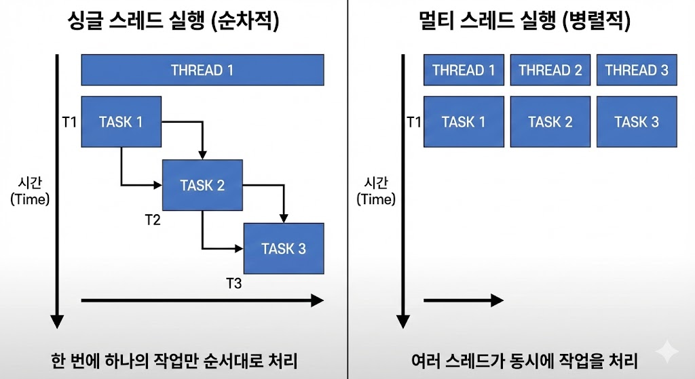

## 멀티 스레드 (Multi Thread)란?


- 멀티 스레드는 ***하나의 프로세스에서 여러 개의 스레드를 동시에 실행하는 것***을 의미한다.
- 웹 서버를 떠올려 보면 하나의 웹 서버(프로세스)가 여러 사용자의 요청(스레드)를 동시에 처리하는 것을 알 수 있다. 만약 싱글 스레드로 구현되어 있다면, 웹 서버는 한 번에 하나의 요청만 처리할 수 있어 매우 비효율적일 것이다.
- 멀티 스레드에 대한 자세한 내용을 알기 전에 먼저 운영체제, 프로세스, 스레드에 대한 개념을 이해하는 것이 중요하다.

### 운영체제와 프로세스와 스레드

#### 운영체제
- 운영체제는 프로세스를 관리하는 주체로써 ***자원(Resource)를 효율적으로 관리하는 역할을*** 한다.
  > 물론 자원 관리를 제외한 다른 역할도 한다. (사용자 인터페이스 제공, 보안, 네트워크 지원..)
- 대표적인 자원 관리 역할로써 CPU 관리와 메모리 관리가 존재한다.
    - CPU 관리: CPU 스케줄러를 통해서 여러 실행 가능한 작업들 중에서 어떤 ***작업(커널 수준 스레드: Kernel-level Thread, 프로세스)을 얼마동안 할당할지를 결정***하고, Context Switching으로 현재 ***작업중이던 작업을 저장하고 다른 작업을 수행***한다.
    - 메모리 관리: 프로세스별로 독립적인 메모리 공간을 할당하고, 프로세스간의 메모리 영역을 침범하지 못하도록 보호한다.

#### 프로세스
- 프로그램이 메모리에 로드되어 운영체제에 실행될때 이를 프로세스라고한다.
- 프로세스는 운영체제로 부터 ***독립적인 자원을 할당받아 실행되기 때문에 자신만의 가상 주소 공간과 메모리를 공유하지 않는 특징***이 있기 때문에 프로세스간의 메모리에 직접 접근할 수 없다.
- 프로세스가 생성될때 운영체제는 ***프로세스를 관리하기 위하여 프로세스에 대한 중요한 정보를 저장하고 관리하는데 이를 PCB(Process Control Block)*** 라고 한다.
    - 운영체제는 PCB를 바탕으로 현재 작업중이던 프로세스의 상태를 저장하고 다음에 작업해야할 프로세스의 상태를 복원하는 과정을 통해서 Context Switching을 하며 멀티태스킹이 가능해진다.

#### 스레드
- ***스레드는 프로세스내에서 실행되는 하나의 경량 프로세스(lightweight process), 실행 단위***로써 하나의 프로세스는 하나 이상의 스레드를 가질 수 있다.
- 스레드는 ***프로세스 내에서 실행되기 때문에 동일한 가상 주소 공간과 메모리를 공유할 수 있다는 특징***이 있으며 이로 인해서 스레드의 Context Switching이 프로세스의 Context Switching 보다 저렴하다.
    - 스레드의 Context Switching이 프로세스보다 저렴한 이유는 자원을 공유하기 때문에 진행중이던 작업의 상태 저장이나 다른 작업을 복원하는 과정이 프로세스 보다 간단하고 적기 때문이다.

### 멀티 스레드가 등장한 이유는?
- 초기 프로그램은 입력을 받아 처리하고 결과를 출력하는 단순한 구조였다. 이로 인해서 ***I/O 작업이 발생하면 CPU는 아무 일도 하지 못하고 대기한 이후에 결과를 출력하는 방식***이었다.
    - 즉 CPU가 I/O 작업이 끝날 때까지 놀고 있는 시간이 많았다. 이는 ***자원을 효율적으로 사용하지 못하는 문제를 야기***했다.


- 이를 해결하기 위하여 멀티 프로세스와 멀티 스레드가 등장하게 되었다. 멀티 스레드와 멀티 프로세스 모두 동시적으로 또는 병렬적으로 작업을 처리할 수 있도록 하여 ***CPU의 유휴 시간을 줄이고, 자원을 효율적으로 사용***할 수 있도록 한다.
    - 특히 공유 자원(ex: 데이터베이스, 파일)을 사용하는 프로그램의 경우, 멀티 프로세스 및 멀티 스레드를 통해 자원을 효율적으로 사용할 수 있다.

#### 멀티 프로세스의 등장
- CPU의 유휴 시간을 줄이기 위해서 ***OS가 짧은 시간 단위로 CPU를 프로세스에게 할당하는 방식***인 멀티 프로세스가 등장했다.
    - 1개의 CPU로도 워드 작업을 하면서 동영상을 재생하는 경우와 같이 여러 작업을 동시에 수행할 수 있게 되었다.
- 멀티 프로세스는 각 프로세스가 독립적으로 실행되며 ***독립적인 메모리 공간***을 가지기 때문에 아래와 같은 특징이 있다.
    - **메모리 격리**: 각 프로세스가 독립적인 메모리 공간을 가지기 때문에, 하나의 프로세스가 다른 프로세스의 메모리에 접근할 수 없다.
    - **안정성**: 하나의 프로세스가 오류가 발생하더라도 다른 프로세스에 영향을 미치지 않는다.
    - **프로세스간의 통신**: 메모리를 공유하지 않기 떄문에, 프로세스간의 통신(IPC: Inter-Process Communication)이 필요할 경우, 별도의 통신 메커니즘(파이프, 소켓, 공유 메모리 등)을 사용해야 한다.
- 멀티 프로세스로 개발된 대표적인 애플리케이션이 브라우저이다. 각 탭이 독립적인 프로세스로 실행되기 때문에, 하나의 탭에서 오류가 발생하더라도 다른 탭에 영향을 미치지 않는다.
- 하지만 멀티 프로세스는 아래와 같은 단점이 존재한다.
    - **높은 메모리 사용량**: 각 프로세스가 독립적인 메모리 공간을 가지기 때문에, 많은 메모리를 사용한다.
    - **느린 생성 속도**: 부모 프로세스가 자식 프로세스를 생성할때, 운영체제에게 메모리 공간을 할당받고, PCB를 생성하는 등의 작업이 필요하기 때문에, 프로세스 생성 속도가 느리다.
    - **높은 Context Switching 비용**: 프로세스간의 전환이 이루어지기 때문에, 컨텍스트 스위칭 오버헤드가 크다.

#### 멀티 스레드의 등장
- 멀티 프로세스의 단점인 보완하기 위하여 높은 메모리 사용량 및 느린 생성 속도, 높은 Context Switching 비용을 해결을 위하여 멀티 스레드가 등장했다.
- 멀티 스레드는 하나의 프로세스 내에서 여러 스레드가 동시에 실행되기 때문에, ***메모리 공유가 가능***하다.
- 특히 멀티 스레드는 웹 서버와 같이 I/O 작업이 빈번하며, 자원의 공유가 잦고 요청이 많은 환경에서 더욱 유리하다.
    - **메모리 공유로 인한 효율적 자원 사용**: 멀티 스레드는 같은 프로세스 내에서 메모리를 공유하기 때문에 적은 메모리를 사용하고, 스레드 간의 자원 공유가 쉽고 빠르다.
    - **Context Switching 비용이 낮음**: 멀티 스레드는 프로세스 내에서 스레드 간의 전환이 이루어지기 때문에, 컨텍스트 스위칭 오버헤드가 적다.
    - **스레드간 빠른 통신 속도**: 멀티 스레드는 같은 프로세스 내에서 스레드 간의 통신이 빠르기 때문에, 요청 처리 속도가 빠르다.
        - 예를 들어 스레드의 상태를 확인하여 현재 유휴중인 스레드를 빠르게 찾아서 작업을 할당할 수 있다.
- 하지만 자원을 공유한다는 특징 때문에, 멀티 스레드 프로그래밍시에는 ***데이터 일관성 문제와 같은 동기화 문제를 반드시 고려***해야 한다.

#### 비동기 논블록킹 I/O
- 멀티 스레드와 더불어 비동기 논블록킹 I/O가 등장했다. 비동기 논블록킹 I/O는 I/O 작업이 발생했을때, 해당 ***작업이 완료될때까지 대기하지 않고 다른 작업을 수행할 수 있도록 하는 방식***이다.
    - 브라우저 화면 내에서 다양한 광고 화면이 로딩 됨과 동시에 스크롤을 내릴 수 있는 이유가 이러한 비동기 논블록킹 I/O 방식 덕분이다.
- 동기 블록킹 I/O 방식에서는 요청을 받은 스레드가 해당 작업이 완료될때까지 대기해야 하게된다. 이로 인해서 스레드가 고갈되어 더이상 요청을 처리하지 못하는 상황이 발생할 수 있다.
- 하지만 비동기 논블록킹 I/O 방식에서는 요청을 받은 스레드가 해당 작업이 완료될때까지 대기하지 않고, 다른 작업을 수행할 수 있기 때문에 스레드의 고갈 문제를 해결할 수 있다.

> 참고로, 요청에 대한 처리량이 증가한다는 것이지, 개별 요청에 대한 처리 속도가 빨라진다는 의미는 아니다.

#### 가상 스레드의 등장
- 최근에는 멀티 스레드의 단점을 보완하기 위하여 가상 스레드(Virtual Thread)가 등장했다. 가상 스레드는 운영체제의 커널 수준 스레드와 1:1로 매핑되지 않고, 사용자 수준에서 관리되는 경량 스레드이다.

> [Java의 미래, Virtual Thread](https://techblog.woowahan.com/15398/)

## 멀티 스레드 프로그래밍시 주의해야할 사항
- 멀티 스레드는 메모리를 공유하기 때문에 공유 자원에 대한 접근이 쉽지만, 이로 인해서 여러 스레드가 동시에 동일한 자원에 접근하게 될 경우 ***데이터 일관성 문제가 발생할 수 있다.***
- 때문에 멀티 스레드 프로그래밍시에는 공유 자원에 대한 접근을 제어하는 동기화(Synchronization) 기법을 반드시 사용해야 한다.

### 경쟁상태(Race Condtion)와 임계영역(Critical Section)

- 동기화를 통해서 데이터의 일관성을 유지하기전에 먼저 ***어떤 상황이나 영역에 동기화가 필요한지를 먼저 파악***해야한다.
    - ***경쟁상태(Race Condtion): 여러 프로세스나 스레드가 동시에 공유 자원에 접근하여 데이터의 일관성이 깨지는 상황***
    - ***임계영역(Critical Section): 경쟁 상태가 발생하는 영역 또는 코드 블록***

#### 동기화 기법이 필요한 이유

```java
public static class Counter {
    private int value;

    public void increment() {
        value++;
    }

    public int getValue() {
        return value;
    }
}

public static void main(String[] args) throws InterruptedException {

    // 공유 자원
    Counter counter = new Counter();

    // 100개의 스레드 생성
    int threadCount = 100;
    Thread[] threads = new Thread[threadCount];

    for (int i = 0; i < threadCount; i++) {

        threads[i] = new Thread(() -> {
            // 각 스레드는 카운트를 1 증가
            try {
                sleep(10);
                counter.increment();
            } catch (InterruptedException e) {
                throw new RuntimeException(e);
            }
        });
    }

    // 모든 스레드 시작
    for (int i = 0; i < threadCount; i++) {
        threads[i].start();
    }

    // 모든 스레드가 종료될 때까지 대기
    for (int i = 0; i < threadCount; i++) {
        threads[i].join();
    }

    // 최종 카운트 출력
    System.out.println("count = " + counter.getValue());

}

```

- 위의 `Counter` 클래스는 `increment()` 메서드를 통해서 값을 1씩 증가시키는 기능을 제공한다.
- 멀티 스레드 환경에서는 여러 스레드가 동시에 `increment()` 메서드를 호출할 경우 기대하는 결과값이 나오지 않을 수 있다.
- `increment()` 메서드를 통해서 `value` 값을 증가시키는 과정은 해석해보면 아래와 같다.
    - `value` 값을 읽어온다.
    - `value` 값을 1 증가시킨다.
    - 증가된 값을 다시 `value`에 저장한다.
- 멀티 스레드 환경에서의 동작 방식은 아래와 같이 동작할 수 있다.

```text
Thread-1: value 읽기 (value = 0)
Thread-2: value 읽기 (value = 0)
Thread-1: value 증가 (value = 1)
Thread-2: value 증가 (value = 1)
Thread-1: value 저장 (value = 1)
Thread-2: value 저장 (value = 1)
```
- `Counter` 클래스의 `increment()` 메서드를 멀티 스레드 환경에서 실행하게 되면, `value` 값이 2가 아닌 1로 저장되는 상황이 발생한다. 데이터의 일관성이 깨지는 경쟁 상태가 발생했으며
  `increment()` 메서드가 임계 영역이라는 것을 알 수 있다.
