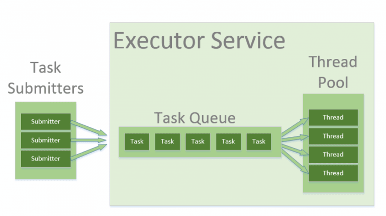

## java.util.concurrent 고수준 비동기 API 프로그래밍의 필요성
- 개발자가 애플리케이션을 개발하면서 `Thread`와 `Runnable`을 직접 사용하여 비동기 작업을 수행하는 경우 많은 것을 신경쓰면서 코드를 작성해야한다. 
  - 프로세스 내에 스레드의 생명 주기(생성/종료)를 직접 관리해야하는 어려움
  - 스레드 갯수 관리의 어려움 (프로세스의 시작 및 실행 시점)
  - 프로그램 종료시 현재 작업중인 스레드를 어떻게 처리할지 고민해야하는 어려움
  - 위의 문제를 고려해가며 비지니스 로직을 작성해야하는 어려움
- Java 1.5부터 제공되는 `java.util.concurrent` 패키지의 `Executor`는 이러한 문제를 해결하기 위한 고수준 비동기 API를 제공한다.

## 스레드 풀
- 현대의 웹 애플리케이션에서 서버의 역할은 동시에 많은 클라이언트의 요청을 처리하여 빠른 응답을 제공하는 것이다.
- 만약 사용자의 요청에 따라 매번 새로운 스레드를 생성한다면 아래와 같은 문제가 발생할 수 있다.
  - 스레드 생성 비용으로 인한 성능 저하 발생
  - 스레드 갯수 관리의 어려움으로 인한 서버 자원 고갈
- 이러한 문제를 해결하기 위해서는 애플리케이션의 실행시점 부터 종료 시점까지 스레드를 관리할 수 있는 스레드 풀(Thread Pool)이 필요하다.
  - 스레드 풀은 요청 시점 마다 스레드를 생성하는 것이 아닌, 미리 생성된 스레드를 재사용할 수 있다.
  - 스레드 풀은 스레드의 갯수를 관리하여 서버 자원의 고갈을 방지할 수 있다.

### 스레드 풀의 동작 방식



1. 클라이언트는 작업을 제출한다.
2. 제출한 작업은 스레드 풀에 있는 작업 큐에 저장된다.
3. 스레드 풀에 있는 스레드는 작업 큐에 작업을 가져와 작업을 수행한다.
   - 이때 스레드 풀은 미리 생성된 스레드를 사용하여 작업을 수행한다.
   - 생성된 스레드 수만큼 작업을 동시에 수행할 수 있다.
4. 작업 큐에 작업이 없을 경우, 생성된 스레드를 종료시키지 않고 대기 상태로 만들어 새로운 작업이 들어올 때까지 기다린다.

### Graceful Shutdown (우아한 종료)
- 


### 간단한 스레드 풀 구현해보기
- 위 동작 방식을 기반으로 [간단한 스레드 풀 구현](./MyThreadPool.java)을 구현해보자.

```java
public class MyThreadPool {
    
    private final BlockingQueue<Runnable> taskQueue;
    private final List<Worker> workers = new ArrayList<>();
    private boolean isShutdown = false;

    public MyThreadPool(int corePoolSize, int taskSize) {
        taskQueue = new LinkedBlockingQueue<>(taskSize);

        // 스레드를 미리 생성한 이후 실행하여, Thread를 RUNNABLE 상태로 만들어 작업을 수행할 수 있도록 한다.
        for (int i = 0; i < corePoolSize; i++) {
            Worker worker = new Worker();
            workers.add(worker);
            worker.thread.start();
        }

    }

    public void submit(Runnable task) {
        if (task == null) {
            throw new IllegalArgumentException("task cannot be null");
        }

        // BlockingQueue의 offer() 메서드는 큐가 가득 찼을 경우, 작업을 추가하지 않고 false를 반환
        if (!taskQueue.offer(task)) {
            throw new IllegalStateException("taskQueue is full");
        }
    }

    public synchronized boolean isShutdown() {
        return isShutdown;
    }

    // shutdown 메서드는 스레드 풀이 관리하고 있는 모든 스레드를 종료시키기 위한 메서드
    public synchronized void shutdown() {
        isShutdown = true;
        for (Worker worker : workers) {
            worker.shutdown();
        }
    }

    class Worker implements Runnable {

        private boolean isShutdown = false;
        private final Thread thread = new Thread(this);

        @Override
        public void run() {
            while (!isShutdown) {
                Runnable task = null;
                try {
                    // BlockingQueue의 take() 메서드는 큐가 비어있을 경우, 작업이 추가될 때까지 대기한다.
                    // shutdown() 메서드가 호출 되면, 작업이 추가될 때까지 대기하지 않는다.
                    task = taskQueue.take();
                } catch (InterruptedException e) {
                    Thread.currentThread().interrupt();
                }

                if (task != null) {
                    task.run();
                }
            }
        }

        // shutdown 메서드는 Worker 스레드를 인터럽트 시켜 작업을 중지하기위한 메서드
        public synchronized void shutdown() {
            isShutdown = true;
            thread.interrupt();
        }
    }
}
```
- 위의 코드는 간단한 스레드 풀을 구현한 예시로, `BlockingQueue`를 사용하여 작업 큐를 관리하고, `Worker` 클래스를 통해 작업 큐에서 작업을 가져와 실행하는 구조이다.
- `MyThreadPool` 클래스를 생성하게 되면, 지정된 개수의 스레드를 미리 생성하고 작업 큐를 초기화한다.
  - `Worker` 클래스에서 `isShutdown` 변수를 통해 `shutdown()` 메서드가 호출되기 전까지 스레드를 계속 실행하도록 한다.
  - `taskQueue.take()` 메서드를 사용하여 작업 큐에서 작업을 가져와 수행하고, 작업 큐가 비어있을 경우에는 작업이 추가될 때까지 대기한다.
- 클라이언트는 `submit(Runnable task)` 메서드를 통해 작업을 제출할 수 있으며, 해당 작업을 작업 큐에 추가한다. 만약 작업 큐가 가득 찼을 경우 예외가 발생한다.


## Executor, ExecutorService, Executors
- `Executor` 와 `ExecutorService`는 Java 1.5부터 제공되는 인터페이스로, 대부분의 구현체들이 쓰레드의 생성과 관리를 위한 스레드풀을 제공한다.
  - 때문에 개발자가 스레드 풀을 직접 구현할 필요 없이, 해당 구현체를 사용하여 스레드 풀을 쉽게 사용할 수 있다.
- `Executors` 클래스는 다양한 스레드 풀을 생성하기 위한 유틸리티 클래스로, `Executor`와 `ExecutorService`의 구현체를 생성하는 메서드를 제공한다.

### Executor
- `Executor`는 작업을 실행하기 위한 단순한 인터페이스로, `Runnable` 객체를 실행하는 메서드인 `execute(Runnable command)`를 제공한다.

### ExecutorService
- `ExecutorService`는 `Executor`의 하위 인터페이스로, 제출된 작업을 비동기로 실행하고 관리하며, 작업의 종료를 관리할 수 있는 메서드를 제공한다.

#### 제출된 작업을 비동기로 실행 및 관리
- `ExecutorService`를 통해서 작업을 제출하게 되면 비동기로 실행되며, 작업의 결과를 `Future` 객체로 반환한다.
  - `Future` 객체를 통해서 작업의 결과를 가져오거나, 작업의 상태를 확인하거나 관리할 수 있다.
- `Future<T> submit(Callable<T> task);`
  - 작업을 제출하고, 결과를 `Future` 객체로 반환한다.
- `<T> T invokeAny(Collection<? extends Callable<T>> tasks) throws InterruptedException, ExecutionException;`
  - 여러 개의 작업을 제출하고, 가장 먼저 완료된 작업의 결과를 반환한다.
- `<T> List<Future<T>> invokeAll(Collection<? extends Callable<T>> tasks) throws InterruptedException;`
  - 여러 개의 작업을 제출하고, 모든 작업의 결과를 `Future` 객체로 반환한다.

#### 작업의 종료 관리


- `void shutdown();`
  - 해당 메서드를 호출한 이후에는 더이상 작업을 제출할 수 없다.
  - 현재 실행 중이거나 대기 중인 작업이 완료된 이후 종료된다.
- `List<Runnable> shutdownNow();`
  - 해당 메서드를 호출한 이후에는 더이상 작업을 제출할 수 없으며, 대기중인 작업을 취소한다.
  - 현재 실행 중인 작업의 스레드를 인터럽트 시켜 작업 중단을 시도한다.
  - 대기 중인 작업 리스를 반환하여 어떻게 해당 작업을 처리할지 결정할 수 있다.
- `boolean isShutdown();`
  - `Executor`의 `shutdown(), shutdownNow()` 메서드가 호출되었는지 여부를 반환한다.
- `boolean isTerminated();`
  - `Executor`의 `shutdown(), shutdownNow()` 메서드가 호출된 이후, 모든 작업이 완료되었는지 여부를 반환한다.
- `boolean awaitTermination(long timeout, TimeUnit unit) throws InterruptedException;`
  - `Executor`의 종료 요청 이후, 지정된 시간 만큼 호출 스레드를 대기 시킨다.
  - 이후 모든 작업이 완료되었는지에 대한 여부를 반환한다.

### ThreadPoolExecutor
- `ThreadPoolExecutor`는 `ExecutorService`의 구현체로, 여러 스레드를 사용하여 작업을 병렬로 처리할때, 시스템 자원을 효율적으로 관리할 수 있는 기능을 제공한다.
- `ExecutorService`의 구현체이므로 작업의 제출 및 관리, 종료뿐만 아니라 스레드의 갯수 제한, 작업 큐 설정, 작업 거부 정책 등을 설정할 수 있다.

#### ThreadPoolExecutor 구성 요소
```java
public ThreadPoolExecutor(int corePoolSize,
                          int maximumPoolSize,
                          long keepAliveTime,
                          TimeUnit unit,
                          BlockingQueue<Runnable> workQueue,
                          ThreadFactory threadFactory,
                          RejectedExecutionHandler handler)
```
- `corePoolSize`: 스레드 풀 내에서 항상 유지되는 최소한의 스레드 수
- `maximumPoolSize`: 스레드 풀이 가질 수 있는 최대 스레드 수
- `keepAliveTime`: 스레드가 작업을 수행하지 않을 때 스레드가 유지되는 시간
- `unit`: `keepAliveTime`의 시간 단위
- `workQueue`: 작업을 저장하는 큐 (예: `SynchronousQueue`, `LinkedBlockingQueue`, `ArrayBlockingQueue` 등)
- `threadFactory`: 스레드를 생성하는 팩토리 클래스
- `handler`: 작업이 거부되었을 때의 처리 정책 (예: `AbortPolicy`, `CallerRunsPolicy`, `DiscardPolicy`, `DiscardOldestPolicy`)


#### ThreadPoolExecutor의 동작 방식
- 작업 요청: `submit()` 메서드르 통해서 작업을 제출하게 되면, `execute()` 메서드를 통해 작업 처리 여부를 결정하게 된다.
- corePoolSize 확인: `corePoolSize` 이하의 스레드가 실행 중인 경우, 새로운 스레드를 생성하여 작업을 수행하게 된다.
- workQueue 추가: `corePoolSize` 이상의 스레드가 실행 중인 경우, 작업은 `workQueue`에 추가 되어 대기하게 된다.
- maximumPoolSize 확인: `workQueue`가 가득 차고 `corePoolSize` 만큼 스레드가 실행 중인 경우, `maximumPoolSize`를 확인하여 추가 스레드를 생성할 수 있는지 여부를 결정한다.
- 작업 거부 정책: `maximumPoolSize`에 도달한 이후에도 작업이 제출되면, 설정된 작업 거부 정책에 따라 작업을 처리하게 된다.
- 유휴 상태 전환: `keepAliveTime`이 설정되어 있는 경우, `corePoolSize` 이상의 스레드는 유휴 상태로 전환되어 종료될 수 있다.

#### ThreadPoolExecutor 사이즈 설정 및 확인

```java
// corePoolSize: 1, maximumPoolSize: 2, workQueue: 1
ThreadPoolExecutor threadPoolExecutor = new ThreadPoolExecutor(1,
        2,
        0L,
        TimeUnit.SECONDS,
        new LinkedBlockingQueue<>(1));

threadPoolExecutor.submit(() -> {
    // 작업1 시작...
});

threadPoolExecutor.submit(() -> {
    // 작업2 시작...
});

threadPoolExecutor.submit(() -> {
    // 작업3 시작...
});
```
- 위 예시는 `corePoolSize`가 1, `maximumPoolSize`가 2, `workQueue`의 크기가 1인 `ThreadPoolExecutor`를 생성한 예시이다.
```text
pool size = 0, active threads = 0, queued tasks = 0, ThreadPoolExecutor 초기화
pool size = 1, active threads = 1, queued tasks = 0, 작업1 진행중
pool size = 1, active threads = 1, queued tasks = 1, 작업1 진행중, 작업2 workQueue에 추가
pool size = 2, active threads = 2, queued tasks = 1, 작업1 진행중, 작업2 진행중, 작업3 workQueue에 추가
....
```
- 스레드 풀의 크기 설정은 각 시스템 자원에 따라 적재적소로 설정해야 자원을 효율적으로 사용할 수 있다.
  - 만약 대기열의 크기를 크게 설정하고 풀 사이즈를 작게 설정하게 될 경우, 작업이 대기열에 쌓여 처리량이 낮아질 수 있다.
  - 반대로 대기열의 크기를 작세 설정하고 풀 사이즈를 크게 설정하게 될 경우, 자원을 많이 소모하게 되며 작업이 거부될 수 있는 있다.

> [ThreadPoolExecutor 사이즈 설정 및 확인](../../../../../../test/java/org/example/concurrency/executor/ThreadPoolExecutorMain1.java)

#### ThreadPoolExecutor의 keepAliveTime 설정을 유휴 상태 전환
- `ThreadPoolExecutor`의 `keepAliveTime`을 설정하여, `corePoolSize` 이상의 활성화 되어 있는 스레드를 유휴 상태로 전환할 수 있다.
  - `keepAliveTime`이 끝나기 전에 새로운 작업이 들어오면, 해당 스레드는 유휴 상태로 전환되지 않고 계속 유지된다.
  - `keepAliveTime`이 끝나고 새로운 작업이 들어오지 않으면, 해당 스레드는 종료된다.
```java
// corePoolSize: 1, maximumPoolSize: 2, workQueue: 1, keepAliveTime: 1초
ThreadPoolExecutor threadPoolExecutor = new ThreadPoolExecutor(1,
        2,
        1L,
        TimeUnit.SECONDS,
        new LinkedBlockingQueue<>(1));

threadPoolExecutor.submit(() -> {
    // 작업1 시작...
});

threadPoolExecutor.submit(() -> {
    // 작업2 시작...
});

threadPoolExecutor.submit(() -> {
    // 작업3 시작...
});
```
- 위 예시는 `corePoolSize`가 1, `maximumPoolSize`가 2, `workQueue`의 크기가 1, `keepAliveTime`이 1초인 `ThreadPoolExecutor`를 생성한 예시이다.
```text
pool size = 0, active threads = 0, queued tasks = 0, ThreadPoolExecutor 초기화
pool size = 1, active threads = 1, queued tasks = 0, 작업1 진행중
pool size = 1, active threads = 1, queued tasks = 1, 작업1 진행중, 작업2 workQueue에 추가
pool size = 2, active threads = 2, queued tasks = 1, 작업1 진행중, 작업2 진행중, 작업3 workQueue에 추가
pool size = 2, active threads = 2, queued tasks = 0, 작업1 작업 완료, 작업2 진행중, 작업3 진행중
pool size = 2, active threads = 2, queued tasks = 0, 작업1 작업 완료, 작업2 진행중, 작업3 진행중
pool size = 2, active threads = 1, queued tasks = 0, 작업1 작업 완료, 작업2 작업 완료, 작업3 진행중
pool size = 1, active threads = 0, queued tasks = 0, 작업1 작업 완료, 작업2 작업 완료, 작업3 작업 완료, corePoolSize 이상의 스레드가 keepAliveTime(1초) 이후 유휴 상태로 전환
```

> [ThreadPoolExecutor의 keepAliveTime 설정을 유휴 상태 전환](../../../../../../test/java/org/example/concurrency/executor/ThreadPoolExecutorMain1.java)

#### ThreadPoolExecutor의 작업 거부 정책 설정
- `ThreadPoolExecutor`는 현재 스레드 풀 내의 모든 스레드가 작업을 수행하고 작업 큐가 가득 찬 경우, 이후에 들어오는 작업에 대해서 작업 거부 정책을 설정할 수 있다.
- 작업 거부 정책은 `RejectedExecutionHandler` 인터페이스를 구현하여 설정하여 직접 구현도 가능하고, 기본적으로 제공하는 구현체를 사용할 수 있다.
  - `CallerRunsPolicy`: 작업이 거부되면 호출한 스레드가 작업을 직접 실행한다.
  - `AbortPolicy`: 작업이 거부되면 `RejectedExecutionException` 예외를 발생시킨다.
  - `DiscardPolicy`: 작업이 거부되면 해당 작업을 무시한다.
  - `DiscardOldestPolicy`: 작업이 거부되면 가장 오래된 작업을 제거하고, 거부된 작업을 `execute()` 메서드를 통해 다시 시도한다.
    - 이 정책은 작업 큐가 가득 찼을 때 가장 오래된 작업을 제거하고 새로운 작업을 추가하는 방식으로 동작한다.


### ScheduledThreadPoolExecutor
- `ScheduledThreadPoolExecutor`는 `ThreadPoolExecutor`의 하위 클래스이며, `ScheduledExecutorService` 인터페이스를 구현한 클래스다.
- `ScheduledThreadPoolExecutor`를 활용하면 작업을 일정 시간 후에 실행하거나, 주기적을 실행할 수 있다.

#### ScheduledThreadPoolExecutor 메서드  
- `schedule`
  - 지정된 시간 후에 작업을 수행한다.
- `scheduleAtFixedRate`
  - 지정된 시간 간격으로 작업을 반복적으로 수행한다.
  - 작업을 시작한 시점부터 지정된 시간 간격으로 작업을 수행한다.
  - 정확한 시간에 작업을 수행해야할 경우 사용한다.
- `scheduleWithFixedDelay`
  - 지정된 시간 간격으로 작업을 반복적으로 수행한다.
  - 이전 작업이 완료된 시점부터 지정된 시간 간격으로 작업을 수행한다.
  - 이전 작업이 종료된 이후 지정된 시간 간격으로 작업을 수행해야할 경우 사용한다.

> [ScheduledThreadPoolExecutor 메서드 테스트](../../../../../../test/java/org/example/concurrency/executor/ScheduledThreadPoolExecutorMain1.java)


### ForkJoinPool


### Executors


  
> [The Java Tutorials > Executors](https://docs.oracle.com/javase/tutorial/essential/concurrency/executors.html)
> [Baeldung > Introduction to Thread Pools in Java](https://www.baeldung.com/thread-pool-java-and-guava)
> [Baeldung > A Guide to the Java ExecutorService](https://www.baeldung.com/java-executor-service-tutorial)
> [Bealdung > Guide to the Fork/Join Framework in Java](https://www.baeldung.com/java-fork-join)