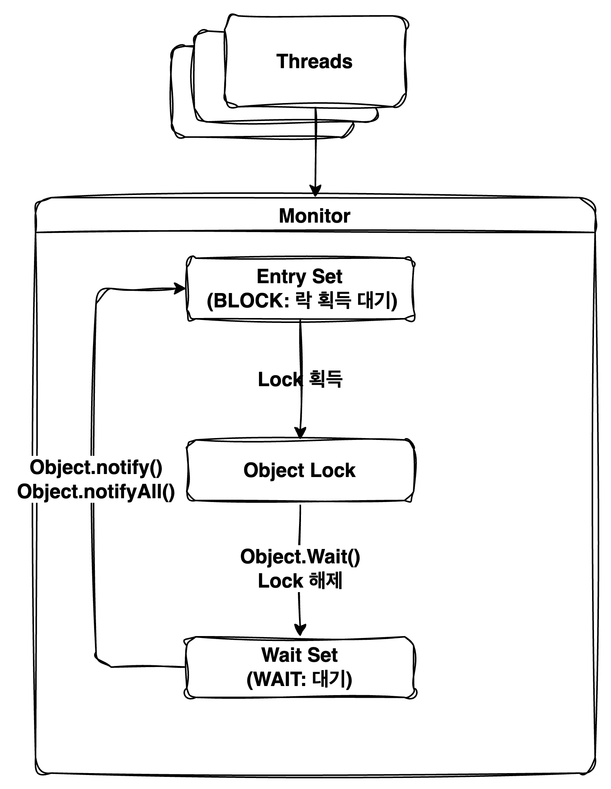

## 동기화(Synchronization)

- 동기화란 여러 프로세스나 스레드가 공유 자원에 접근할 때, ***공유 자원의 충돌을 방지하고 작업의 순서를 보장하여 데이터의 일관성을 유지하기 위한 과정***이다.
- 동기화를 하기위해서는 어느 상황에 어떤 영역을 동기화해야하는지를 먼저 파악해야하며, 이후에는 동기화 기법을 통해서 데이터의 일관성을 유지할 수 있어야 한다.

## 동기화가 필요한 상황과 영역 파악

- 동기화를 통해서 데이터의 일관성을 유지하기전에 먼저 ***어떤 상황이나 영역에 동기화가 필요한지를 먼저 파악***해야한다.
    - ***경쟁상태(Race Condtion): 여러 프로세스나 스레드가 동시에 공유 자원에 접근하여 데이터의 일관성이 깨지는 상황***
    - ***임계영역(Critical Section): 경쟁 상태가 발생하는 영역 또는 코드 블록***

### 경쟁상태(Race Condtion)와 임계영역(Critical Section)

```java
public static class Counter {
    private int value;

    public void increment() {
        value++;
    }

    public int getValue() {
        return value;
    }
}
```
> [동시성 문제 발생 예제](./SynchronizationMain1.java) <br/>

- 위의 `Counter` 클래스는 `increment()` 메서드를 통해서 값을 1씩 증가시키는 기능을 제공한다.
- 멀티 스레드 환경에서는 여러 스레드가 동시에 `increment()` 메서드를 호출할 경우 기대하는 결과값이 나오지 않을 수 있다.
- `increment()` 메서드를 통해서 `value` 값을 증가시키는 과정은 해석해보면 아래와 같다.
    - `value` 값을 읽어온다.
    - `value` 값을 1 증가시킨다.
    - 증가된 값을 다시 `value`에 저장한다.
- 멀티 스레드 환경에서의 동작 방식은 아래와 같이 동작할 수 있다.

```text
Thread-1: value 읽기 (value = 0)
Thread-2: value 읽기 (value = 0)
Thread-1: value 증가 (value = 1)
Thread-2: value 증가 (value = 1)
Thread-1: value 저장 (value = 1)
Thread-2: value 저장 (value = 1)
```

- `Counter` 클래스의 `increment()` 메서드를 멀티 스레드 환경에서 실행하게 되면, `value` 값이 2가 아닌 1로 저장되는 상황이 발생한다. 데이터의 일관성이 깨지는 경쟁 상태가 발생했으며
  `increment()` 메서드가 임계 영역이라는 것을 알 수 있다.

## Java Synchronized 키워드
- Java에서는 동기화를 위해 `synchronized` 키워드를 제공한다. ***`synchronized` 키워드는 메서드나 코드 블록에 적용할 수 있으며, 해당 영역에 대한 접근을 동기화하여 경쟁 상태를 방지***한다.
  - `synchronized` 키워드를 사용하면 해당 ***메서드나 블록에 접근하는 스레드는 하나만 허용되며, 다른 스레드는 해당 영역이 해제될 때까지 대기***하게 된다.
- `synchronized` 키워드를 통하여 ***동기화가 가능한 이유는 객체마다 내장된 모니터 락(Monitor Lock)을 가지고 있기 때문이다.***
  > 자바는 객체 지향 언어이며 객체는 공유 자원으로써 멀티 스레드 환경에서 데이터의 일관성이 깨질 수 있기 때문에, 자연스럽게 자바에서는 객체 단위의 동기화 기법을 제공한다는 것을 유추해볼 수 있다.

### Synchronized 키워드 사용 방법

#### Synchronized 키워드 선언
- `synchronized` 키워드는 메서드에 선언하거나, 코드 블록에 선언하여 사용할 수 있다.
```java
public static class Counter {
    private int value;
    private final Object lock = new Object();

    /**
     * synchronized 메서드로 동기화된 increment 메서드
     */
    public synchronized void increment() {
        value++;
    }

    /**
     * synchronized 블록을 사용하여 동기화된 increment 메서드
     */
    public void increment() {
        synchronized (this) {
            value++;
        }
    }

    /**
     * synchronized 블록을 사용하여 동기화된 increment 메서드
     */
    public void increment() {
        synchronized (lock) {
            value++;
        }
    }
    
    public int getValue() {
        return value;
    }
}
```
> [synchronized 키워드 사용 예제](./SynchronizationMain2.java)  <br/>

- `synchronized` 키워드를 활용하여 멀티 스레드 환경에서도 동시성 이슈가 발생하지 않은 이유는 아래와 같다
```text
Thread-1: value 읽기 (value = 0, lock 획득) 
Thread-2: (lock 획득 대기)
Thread-1: value 증가 (value = 1)
Thread-1: value 저장 (value = 1, lock 해제)
Thread-2: value 읽기 (value = 1, lock 획득)
Thread-2: value 증가 (value = 2)
Thread-2: value 저장 (value = 2, lock 해제)
```

#### Synchronized 키워드 선언 레벨에 따른 락의 범위
- `synchronized` 키워드는 ***클래스 레벨과 인스턴스 레벨에서 선언이 가능하며, 해당 레벨에 따라서 락의 범위가 달라진다.***
- 때문에 `synchronized` 키워드를 선언할 때는 해당 ***메서드나 블록이 어떤 범위의 락을 사용하는지를 이해하고 사용해야만 데이터의 일관성을 유지***할 수 있다.
  - 인스턴스 레벨 `synchronized` 키워드가 인스턴스 레벨로 선언된 경우, ***해당 인스턴스의 모니터 락을 사용하여 동기화***한다. 즉, 해당 인스턴스에 대한 접근이 동기화된다.
  - 클래스 레벨: `synchronized` 키워드가 정적 메서드에 선언된 경우, ***클래스 자체의 모니터 락을 사용하여 동기화***한다. 즉, 해당 클래스의 모든 인스턴스에 대한 접근이 동기화된다.
- 인스턴스 레벨의 `synchronized` 키워드는 동일 인스턴스에 대해서만 동기화를 적용하며, 다른 인스턴스의 모니터락을 사용하게 되면 동기화가 되지 않는다.
    ```java
    public static class Counter {
        private final Object incrementLock = new Object();
        private final Object decrementLock = new Object();
        private int value;

        // increment 메서드는 incrementLock 인스턴스의 모니터 락을 사용하여 동기화
        public void increment() {
            synchronized (incrementLock) {
                value++;
            }
        }

        // decrement 메서드는 decrementLock 인스턴스의 모니터 락을 사용하여 동기화
        public void decrement() {
            synchronized (decrementLock) {
                value--;
            }
        }


        public int getValue() {
            return value;
        }
    }
    ```
    > [인스턴스 레벨 synchronized 키워드 잘못된 사용 예제](./SynchronizationMain3.java) <br/>
    - 멀티 스레드 환경에서 `increment()`와 `decrement()` 메서드를 동시에 호출하더라도, 서로 다른 인스턴스 모니터 락을 사용하기 때문에 동기화가 되지 않는다.
    ```text
    Thread-1: value 읽기 (value = 0, increment() 호출 incrementLock 획득)
    Thread-2: value 읽기 (value = 0, decrement() 호출 decrementLock 획득)
    Thread-1: value 증가 (value = 1)
    Thread-2: value 감소 (value = -1)
    Thread-1: value 저장 (value = 1, incrementLock 해제)
    Thread-2: value 저장 (value = -1, decrementLock 해제)
    ```
- 클래스 레벨의 `synchronized` 키워드는 동일 클래스에 대해서만 동기화를 적용하며, 다른 클래스의 모니터 락을 사용하게 되면 동기화가 되지 않는다.
    ```java
    public static class Counter {
        public static class IncrementLock {
        }

        public static class DecrementLock {
        }

        private int value;

        // increment 메서드는 IncrementLock 클래스의 모니터 락을 사용하여 동기화
        public void increment() {
            synchronized (IncrementLock.class) {
                value++;
            }
        }

        // decrement 메서드는 DecrementLock 클래스의 모니터 락을 사용하여 동기화
        public void decrement() {
            synchronized (DecrementLock.class) {
                value--;
            }
        }

        public int getValue() {
            return value;
        }
    }    
    ```
    > [클래스 레벨 synchronized 키워드 잘못된 사용 예제](./SynchronizationMain4.java) <br/>
    - 멀티 스레드 환경에서 `increment()`와 `decrement()` 메서드를 동시에 호출하더라도, 서로 다른 클래스 모니터 락을 사용하기 때문에 동기화가 되지 않는다.
    ```text
    Thread-1: value 읽기 (value = 0, increment() 호출 IncrementLock 획득)
    Thread-2: value 읽기 (value = 0, decrement() 호출 DecrementLock 획득)
    Thread-1: value 증가 (value = 1)
    Thread-2: value 감소 (value = -1)
    Thread-1: value 저장 (value = 1, IncrementLock 해제)
    Thread-2: value 저장 (value = -1, DecrementLock 해제)
    ```

### 모니터(Monitor)
- Java에서 `synchronized` 키워드를 통하여 ***동기화가 가능한 이유는 객체마다 내장된 모니터 락(Monitor Lock)을 가지고 있기 때문이다.***
  > 참고로 클래스 레벨의 `synchronized` 키워드는 클래스 객체(Class Object)의 모니터 락을 사용한다. <br/>
  > ***Instances of the class Class represent classes and interfaces in a running Java application. An enum class and a record class are kinds of class; an annotation interface is a kind of interface.***  <br/>
  > [Java Docs > Class](https://docs.oracle.com/en/java/javase/21/docs/api/java.base/java/lang/Class.html) <br/>

#### 모니터 구성 요소

- 모니터는 객체의 ***공유 자원을 동기화하기 위하여 뮤텍스(Mutex: Mutual Exclusion)와 조건 변수(Condition Variable)를 사용하여 동기화를 구현***한다.
  - 뮤텍스(Mutex: Mutual Exclusion): 하나의 프로세스나 스레드만 공유 자원에 접근할 수 있도록 하는 동기화 기법
  - 조건 변수(Condition Variable): 특정 조건이 만족될 때 스레드를 일시적으로 대기시키거나 깨우는 역할
    - `wait()`, `notify()`, `notifyAll()` 메서드를 통해서 스레드를 대기시키거나 깨울 수 있다.
- 뮤텍스와 조건 변수를 사용하기 위해서는 스레드가 대기할 수 있는 ***Entry Set과 Wait Set이 필요***하다.
  - Entry Set: 스레드가 공유 자원에 접근하기 전에 대기하는 영역
  - Wait Set: 특정 조건이 만족되어 스레드가 대기하는 영역, 특정 조건이 만족되면 Wait Set에 있는 스레드를 깨워서 작업을 수행할 수 있다.


> [Java Specifications > Synchronization](https://docs.oracle.com/javase/specs/jls/se21/html/jls-17.html#jls-17.1)
> [](https://ionutbalosin.com/2018/06/contended-locks-explained-a-performance-approach/)

## 동기화 기법

- 동기화 기법은 경쟁 상태를 방지하고 임계 영역에 대한 접근을 제어하여 작업의 순서 및 데이터의 일관성을 유지하기 위한 방법이다.
- 뮤텍스(Mutex: Mutual Exclusion): 상호 배제를 위한 동기화 기법으로, 한 번에 하나의 프로세스나 스레드만 공유 자원에 접근할 수 있도록 한다.
- 세마포어(Semaphore): 공유 자원에 접근할 수 있는 프로세스나 스레드의 수를 제한하는 동기화 기법
- 모니터(Monitor): 공유 자원에 대한 접근을 제어하는 객체로, 내부적으로 뮤텍스와 조건 변수를 사용하여 동기화를 구현한다.
    - 조건 변수(Condition Variable): 특정 조건이 만족될 때까지 프로세스나 스레드를 대기시키는 동기화 기법


- 동기화를 하기위한 경쟁상태와 임계영역을 파악한 이후에는 여러 동기화 기법을 통해서 데이터 일관성을 유지할 수 있다.
    - 뮤텍스(Mutex): 상호 배제를 위한 동기화 기법으로, 한 번에 하나의 프로세스나 스레드만 공유 자원에 접근할 수 있도록 한다.
    - 세마포어(Semaphore): 공유 자원에 접근할 수 있는 프로세스나 스레드의 수를 제한하는 동기화 기법
    - 모니터(Monitor): 공유 자원에 대한 접근을 제어하는 객체로, 내부적으로 뮤텍스와 조건 변수를 사용하여 동기화를 구현한다.

> [Java Tutorial Docs > Synchronization](https://docs.oracle.com/javase/tutorial/essential/concurrency/sync.html)