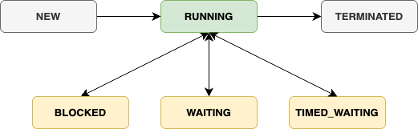

## 운영체제와 프로세스와 스레드

### 운영체제
- 운영체제는 프로세스를 관리하는 주체로써 ***자원(Resource)를 효율적으로 관리하는 역할을*** 한다.
  > 물론 자원 관리를 제외한 다른 역할도 한다. (사용자 인터페이스 제공, 보안, 네트워크 지원..)
- 대표적인 자원 관리 역할로써 CPU 관리와 메모리 관리가 존재한다.
  - CPU 관리: CPU 스케줄러를 통해서 여러 실행 가능한 작업들 중에서 어떤 ***작업(커널 수준 스레드: Kernel-level Thread)을 얼마동안 할당할지를 결정***하고, Context Switching으로 현재 ***작업중인던 작업을 저장하고 다른 작업을 수행***한다.
  - 메모리 관리: 프로세스별로 독립적인 메모리 공간을 할당하고, 프로세스간의 메모리 영역을 침범하지 못하도록 보호한다.

### 프로세스
- 프로그램이 메모리에 로드되어 운영체제에 실행될때 이를 프로세스라고한다.
- 프로세스는 운영체제로 부터 독립적인 자원을 할당받아 실행되기 때문에 메모리를 공유하지 않는 특징이 있다.

### 스레드
- ***스레드는 프로세스내에서 실행되는 하나의 경량 프로세스(lightweight process), 실행 단위***로써 하나의 프로세스는 하나 이상의 스레드를 가질 수 있다.
- 스레드는 프로세스 내의 메모리를 공유할 수 있다는 특징이 있으며 이로 인해서 프로세스의 Context Switch보다 스레드의 Context Switch 비용이 저렴하다.
- 
- 프로세스는 하나이상의 스레드를 가진다.
## 스레드 상태

### Java 스레드
- Java에서 동시성 애플리케이션을 만들기 위하여 `java.lang.Thread` 클래스를 제공한다.
- `java.lang.Thread` 클래스를 이용하여 개발자가 직접 스레드를 생성하고 관리를 하거나, [고수준 동시성 API](https://docs.oracle.com/javase/tutorial/essential/concurrency/highlevel.html)를 통해서 동시성 애플리케이션을 제작하는 방법을 제공한다.

#### 스레드 생성 방법

- java는 `java.lang.Thread`클래스를 통해서 스레드를 생성하고 실행할 수 있다.
- 직접 Thread클래스를 상속받아서 스레드를 생성하거난 Runnable 인터페이스를 통해서 생성할 수 있으며 

- java에서 스레드를 사용하기 위해서는 `java.lang.Thread`클래스를 통해서 생성할 수 있다.
- java.lang.Runnable 인터페이스의 run()
- java.lang.Thread 클래스의 run()
- Runnable 인터페이스를 통해 구현한 구현체는 다른 클래스를 상속 받을 수 있다는 장점이 있으며, 이는 좀더 유연한 구조로 나아갈 수 있으며, Java에서 제공하는 동시성에 대한 고수준 API에도 적용할 수
  있다는 장점이 있다.

#### 스레드 대기/블록킹

#### 스레드 인터럽트(Thread Interrupt)

- 인터럽트는 스레드가 ***현재 진행중인 작업을 중지하고 개발자가 지정한 다른 작업을 수행해야한다는 신호***를 보내는 것을 의미한다.
    - 인터럽트를 활용하지 않고 스레드를 강제종료하게되면 스레드가 사용중이던 자원에 대한 정리가 제대로 이루어 지지 않을 수 있기 때문에, 강제종료보다는 인터럽트를 사용하여 작업을 진행중이던 스레드가 작업을
      정리하고 종료할 수 있도록 설계하는 것이 좋다.

- Thread.interrupted(): 인터럽트 상태가 true인 경우 인터럽트 상태를 초기화한다.
- InterruptedException이 발생하면 인터럽트 상태를 다시 초기화한다.
  > IllegalArgumentException – if the value of millis is negative
  InterruptedException – if any thread has interrupted the current thread. The interrupted status of the current thread
  is cleared when this exception is thrown.