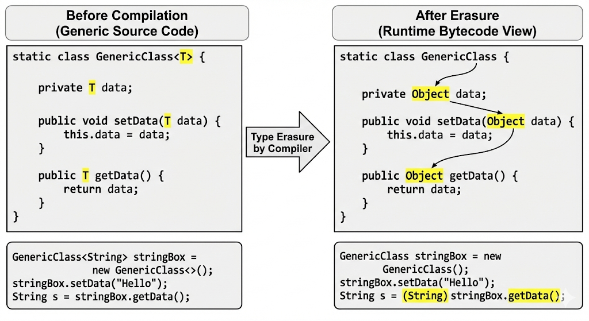

## 제네릭 (Generics)이란?
- 자바에서 제네릭이란 데이터 타입을 미리 정의하지 않고, ***선언할 때 타입을 지정할 수 있도록 하는 기능***이다.
  - JDK 1.5 버전부터 도입되었다.
- 제네릭을 사용하면 ***컴파일 시점에 타입 검사를 수행하여, 프로그램의 안전성을 높이고, 형변환에 따른 오류를 줄일 수 있다.***

### 제네릭 등장하기 전에는 어떻게 했을까?
- 제네릭이 등장하기 전에는 컬렉션 프레임워크에서 다양한 타입의 객체를 저장하기 위해 Object (최상위 클래스) 타입을 사용했다.
```java
List list = new ArrayList();
list.add("String data");
list.add(100);
String element = (String) list.get(0); // 형변환 필요
```
- 이로 인해서 여러가지 문제점이 발생했다.
  - 런타임 오류 발생 가능성 증가: 컴파일 시점에 타입 검사가 이루어지지 않아, 잘못된 타입이 런타임 시점에 사용될 수 있다.
  - 형변환 필요: 데이터를 꺼낼 때마다 명시적인 형변환이 필요하여 코드가 복잡해지고, 형변환 오류가 발생할 수 있다.
  - 타입별 컬렉션 클래스 생성의 번거로움: 만약 타입을 명확히 구분하고 싶다면, 각 타입별로 별도의 컬렉션 클래스를 만들어야 하는 번거로움이 있다.
  - 코드의 가독성 저하: 타입 정보를 명확하게 알기 어려워 코드의 가독성이 떨어진다.

### 타입 파리미터 (Type Parameter)

- 타입 파라미터란 클래스, 인터페이스, 메서드에서 사용할 수 있는 일종의 변수로, `<>` 기호를 내부에 선언된 타입을 말한다.
  - `<타입 파라미터>` 형식으로 선언된다.
- 타입 파라미터는 일반적으로 대문자 한 글자로 표현되며, 가장 흔히 사용되는 타입 파라미터는 다음과 같다
  - T: Type (일반적인 타입)
  - E: Element (요소)
  - K: Key (키)
  - V: Value (값)
  - N: Number (숫자)
- 예를 들어, 제네릭 클래스를 정의할 때 다음과 같이 타입 파라미터를 사용할 수 있다.
```java
class GenericClass<T> {
    
    private T data;

    public void setData(T data) {
        this.data = data;
    }

    public T getData() {
        return data;
    }
}
```

### 제네릭은 어떻게 컴파일 될까?

- 자바 컴파일러는 제네릭 타입을 컴파일할 때, 타입 소거(Type Erasure)라는 과정을 거친다. 타입 소거는 ***제네릭 타입 정보를 컴파일 시점에 제거하고, 실제 코드에서는 Object 타입으로 대체하는 과정***이다.
    - 타입 소거 과정에서 컴파일 시점에 타입 검사가 이루어지며, 런타임 시점에는 개발자가 작성한 제네릭 타입 정보가 사라지게 된다.
    - 이러한 과정을 통해 제네릭이 도입되기 이전(JDK 1.4 이하 버전)의 코드와 호환성을 유지할 수 있다.
- 제네릭의 컴파일 과정에서 Bounded Type Parameter(제한된 타입 파라미터)를 사용하는 경우, 타입 소거 과정에서 상위 타입으로으로 대체된다.
  - Bounded Type Parameter: <T extends 상위타입> 으로 코드를 작성할 경우, 타입 소거 과정으로 상위타입으로 대체된다.
  - Unbounded Type Parameter: <T> 로 코드를 작성할 경우, 타입 소거 과정으로 Object 타입으로 대체된다.



#### 제네릭에 대한 오해와 진실
- 제네릭의 타입 소거 과정을 이해해야하는 이유가 뭘까? 타입 소거 과정을 정확히 이해하지 않으면 ***제네릭에 대하여 오해가 발생하거나 치명적인 오류가 발생***할 수 있다.
  - 형변환이 없기 때문에 성능의 향상이 있다?
  - 제네릭을 사용하면 런타임 시점에 모든 상황에서 타입 안전성이 보장된다?
  - 제네릭은 모든 상황에서 작성할 수 있다?

##### 1. 형변환이 없기 때문에 성능의 향상이 있다?
- 제네릭을 사용하면 컴파일 시점에 타입 검사가 이루어지기 때문에, 런타임 시점에서 형변환이 필요 없다고 생각할 수 있다.
- 하지만, 제네릭 타입은 컴파일 시점에 타입 소거로 인해 Object 타입으로 대체되기 때문에, 런타임 시점에 형변환이 발생한다.
- 따라서, 제네릭을 사용한다고 형변환이 없어지는 것이 아니기 때문에, 성능 향상이 있다고 단정할 수 없다.

##### 2. 제네릭을 사용하면 런타임 시점에 모든 상황에서 타입 안전성이 보장된다?
- 제네릭은 컴파일 시점에 타입 검사를 수행하여, 잘못된 타입이 사용되는 것을 방지한다.
- 하지만, 제네릭 타입은 컴파일 시점에 Object 타입으로 대체되기 때문에, 런타임 시점에서는 타입 안전성이 보장되지 않는다.
- 예를 들어, 제네릭 타입을 사용하여 컬렉션을 정의하더라도, 런타임 시점에 잘못된 타입이 추가될 수 있다.

```java
List<String> stringList = new ArrayList();
List rawList = stringList; // List<Object> 로 캐스팅하여, 타입 파라미터가 아닌 모든 타입 참조 가능하도록 셋팅
rawList.add(1); // 잘못된 데이터 추가
String string = stringList.get(0);// 런타임 시점에 ClassCastException 발생
```

- 위 과정에서 어떠한 일이 발생했을까?
  1.  컴파일 시점에 `List<String>` 타입이 `List` 타입으로 타입 소거가 발생한다. (타입 소거)
  2. `rawList` 변수에 `stringList` 참조가 할당된다. 할당이 가능한 이유는 위에서 이미 설명한 것처럼 타입 소거 과정이 발생하였기 때문이다. (업캐스팅 가능)
  3. `rawList` 변수에 `Integer` 타입의 값이 추가된다. 변수 추가가 가능한 이유는 `rawList` 변수가 `List` 타입이기 때문이다. (타입 체크 이상 없음)
  4. `stringList` 변수에서 값을 꺼낼 때, `String` 타입으로 형변환이 발생한다. 이때, `Integer` 타입의 값이 들어있기 때문에 `ClassCastException` 예외가 발생한다. (런타임 시점에 예외 발생)
- 이러한 현상을 힙 오염(Heap Pollution)이라고 하며, 제네릭이 타입 안정성을 보장하지 않는 대표적인 예시이다.
> 힙 오염: 메모리 영역에서 잘못된 타입의 객체가 저장되는 현상, 이로 인해서 데이터를 꺼낼때 데이터 타입이 맞지 않아 타입 변환 오류(ClassCastException) 예외가 발생

##### 3. 제네릭은 모든 상황에서 작성할 수 있다?
- 제네릭은 타입 소거 과정을 거치기 때문에, 모든 상황에서 제네릭을 작성할 수 있는 것은 아니다.
```java
List<String> list = new ArrayList<>();
if(list instanceof List<Integer>) { // 컴파일 에러 발생
// ...
}
```
- 위 코드는 컴파일 에러가 발생한다. 이유는 `List<Integer>` 타입이 런타임 시점에 `List` 타입으로 타입 소거가 발생하기 때문에, 만약 런타임 시점에 `instanceof` 연산자를 사용하여 타입을 검사한다면, 항상 `true`가 반환되기 때문이다.
```java
interface MyInterface {
    void myMethod(List<String> data);
    void myMethod(List<Integer> data);
}
```
- 위 코드는 컴파일 에러가 발생한다. 이유는 `myMethod` 메서드가 오버로딩 되었지만, 두 메서드의 시그니처가 동일하기 때문에 컴파일러가 이를 구분할 수 없기 때문이다.
  - 타입 소거 과정으로 인하여 두 메서드 모두 `void myMethod(List data);` 로 변환된다.
- 반대로 static 메서드에서 제네릭을 사용 가능한 이유도 타입 소거 과정 때문이다.
```java
// 컴파일 타임에 T는 Object 타입으로 대체된다.
public static <T> T getData(T data) {
    return data;
}

// 해당 코드는 String s = (String) getData("Hello, World!"); 와 동일하게 컴파일 된다.
String s = getData("Hello, World!"); //
```
- static 메서드는 런타임 시점에는 이미 타입이 결정되어야 하기 때문에, 일반적으로 생각하면 제네릭을 사용할 수 없을 것 같다. 하지만 타입 소거 과정으로 인하여 컴파일 시점에 Object 타입으로 대체되고, 사용하는 코드는 컴파일 시점에 타입이 결정되기 때문에, static 메서드에서도 제네릭을 사용할 수 있다.

> [Infa > 자바 제네릭 타입 소거 컴파일 과정 알아보기](https://inpa.tistory.com/entry/JAVA-%E2%98%95-%EC%A0%9C%EB%84%A4%EB%A6%AD-%ED%83%80%EC%9E%85-%EC%86%8C%EA%B1%B0-%EC%BB%B4%ED%8C%8C%EC%9D%BC-%EA%B3%BC%EC%A0%95-%EC%95%8C%EC%95%84%EB%B3%B4%EA%B8%B0)
> [Infa > 힙 오염 (Heap Pollution) 이란?](https://inpa.tistory.com/entry/JAVA-%E2%98%95-%EC%A0%9C%EB%84%A4%EB%A6%AD-%ED%9E%99-%EC%98%A4%EC%97%BC-Heap-Pollution-%EC%9D%B4%EB%9E%80)


## 제네릭 사용해보기


### Bounded Type Parameters (제한된 타입 파라미터)
- 제한된 타입 파라미터는 특정 상위 타입으로 제한된 제네릭 타입을 정의할 때 사용된다.
- 제네릭의 경우 모든 타입 파라미터가 허용되는 자유로움이 있기 때문에, 특정 타입 계층 구조 내에서만 동작하도록 제한하고 싶을 때 유용하다.
- 제한된 타입 파라미터는 `<T extends SuperClass>` 키워드를 사용하여 정의하여, 상위 타입과 그 하위 타입들만 허용할 수 있다.


### Wildcards (와일드카드)
- 자바는 업캐스팅(공변성)과 다운캐스팅(반공변성)을 지원하지만, 제네릭 타입 파라미터에서는 이러한 캐스팅(무공변,불공변)이 제한된다.
```java
// 일반적으로 업캐스팅 가능, 다운캐스팅 불가능, 런타임 시점에 ClassCastException 발생 가능
Object[] upcasting = new Integer[10];
Integer[] downcasting = (Integer[]) upcasting;

// 제네릭에서는 업캐스팅 불가능, 다운캐스팅 불가능, 컴파일 에러 발생
List<Object> upcasting = new ArrayList<Integer>();
List<Integer> downcasting = (List<Integer>) new ArrayList<Object>();
```
- 이러한 현상이 발생하는 이유는 제네릭이 타입 안정성을 보장하기 위해서이다.
  - 제네릭에서 업케스팅/다운캐스팅을 허용하게 되면, 컴파일 시점에 타입 소거 과정으로, 런타임 시점에 `ClassCastException` 예외가 발생할 수 있다. (힙오류)
- 와일드카드는 제네릭 타입에서 업캐스팅과 다운캐스팅, 즉 다형성을 지원하기 위해서 도입되었다.

#### 와일드 카드의 종류 및 특징
- 와일드카드는 `?` 기호로 표현되며, 다음과 같은 세 가지 형태가 존재하며, 각 형태에 따라 다형성을 지원하는 방법이 다르다.

##### 비제한 와일드카드 (Unbounded Wildcards): <?>
- 어느 타입이든 허용하는 와일드카드로써, 주로 읽기 전용으로 사용된다.
  - 값을 추가할 수 없지만 null은 허용한다. (컴파일 에러 발생)
  - 값을 꺼낼 때는 Object 타입으로 반환된다.
```java
List<?> list = new ArrayList<String>();
list.add("Hello"); // 컴파일 에러 발생
Object element = list.get(0); // Object 타입으로 반환
```
- 컴파일러 입장에서 `List<?>` 타입은 어떤 타입이든 올 수 있기 때문에 쓰기 작업시, 힙오류가 발생할 수 있는 상황을 방지하기 컴파일에러가 발생한다.
- 값을 꺼낼 때는 어떤 타입이 올지 모르기 때문에, Object 타입으로 반환한다.

##### 상한 제한 와일드카드 (Upper Bounded Wildcards): <? extends T>
- 특정 타입 T와 그 하위 타입을 허용하는 와일드카드이며, 주로 읽기 전용으로 사용된다.
  - 값을 추가할 수 없지만 null은 허용한다. (컴파일 에러 발생)
  - 값을 꺼낼 때는 T 타입으로 반환된다.
```java
List<? extends Number> list = new ArrayList<Integer>();
list.add(10); // 컴파일 에러 발생
Number element = list.get(0); // Number 타입으로 반환
```
- 컴파일러 입장에서 `List<? extends Number>` 타입은 Number 타입과 그 하위 타입이 올 수 있기 때문에 쓰기 작업시, 힙오류가 발생할 수 있는 상황을 방지하기 컴파일에러가 발생한다.
- 값을 꺼낼 때는 Number 타입과 그 하위 타입이 올 수 있기 때문에, Number 타입으로 반환한다.

##### 하한 제한 와일드카드 (Lower Bounded Wildcards): <? super T>
- 특정 타입 T와 그 상위 타입을 허용하는 와일드카드이며, 주로 쓰기 전용으로 사용된다.
  - 값을 추가할 수 있으며, T 타입과 그 하위 타입을 추가할 수 있다.
  - 값을 꺼낼 때는 Object 타입으로 반환된다.
```java
List<? super Integer> list = new ArrayList<Number>();
list.add(10); // Integer 타입 추가 가능
Object element = list.get(0); // Object 타입으로 반환
```
- 컴파일러 입장에서 `List<? super Integer>` 타입은 Integer 타입과 그 상위 타입이 올 수 있기 때문에 안전하게 쓰기 작업이 가능하다.
- 하지만 값을 꺼낼 때는 어떤 타입이 올지 모르기 때문에, Object 타입으로 반환한다.

#### PECS(Producer Extends, Consumer Super) 원칙
- PECS 원칙은 제네릭 와일드카드를 사용할 때, 생산자(Producer)와 소비자(Consumer)의 역할에 따라 적절한 와일드카드를 선택하는 방법을 제시한다.
  - 생산자(Producer): 데이터를 제공하는 역할을 하는 객체
  - 소비자(Consumer): 데이터를 소비하는 역할을 하는 객체
- PECS 원칙에 따르면, 생산자 역할을 하는 경우에는 상한 제한 와일드카드(`<? extends T>`)를 사용하고, 소비자 역할을 하는 경우에는 하한 제한 와일드카드(`<? super T>`)를 사용해야 한다.
- 이러한 원칙을 사용하느 이유는 와일드 카드의 제약사항에 맞게 제네릭 타입을 설계하여, 타입 안전성을 유지하면서도 유연한 코드를 작성하기 위함이다.
- 특히 컬렉션 프레임워크나 함수형 프로그래밍에서 데이터를 읽어오는 경우에 이러한 원칙이 자주 사용된다.
```java
@FunctionalInterface
public interface Function<T, R> {

    /* .... */

    /**
     * 함수를 통해서 변환 작업을 수행한 후, 결과를 다시 다른 함수에 전달하여 변환 작업을 수행하는 메서드
     * R: 이전 함수의 반환 타입
     * V: 이후 함수의 반환 타입
     */
    default <V> Function<T, V> andThen(Function<? super R, ? extends V> after) {
        Objects.requireNonNull(after);
        return (T t) -> after.apply(apply(t));
    }

    /* .... */
}
```


> [Infa > 자바 제네릭의 공변성 & 와일드카드 완벽 이해](https://inpa.tistory.com/entry/JAVA-%E2%98%95-%EC%A0%9C%EB%84%A4%EB%A6%AD-%EC%99%80%EC%9D%BC%EB%93%9C-%EC%B9%B4%EB%93%9C-extends-super-T-%EC%99%84%EB%B2%BD-%EC%9D%B4%ED%95%B4) <br/>
> [Java Tutorial > Generic](https://docs.oracle.com/javase/tutorial/java/generics/types.html) <br/>
> [Infa > 자바 제네릭(Generics) 개념 & 문법 정복하기](https://inpa.tistory.com/entry/JAVA-%E2%98%95-%EC%A0%9C%EB%84%A4%EB%A6%ADGenerics-%EA%B0%9C%EB%85%90-%EB%AC%B8%EB%B2%95-%EC%A0%95%EB%B3%B5%ED%95%98%EA%B8%B0) <br/>