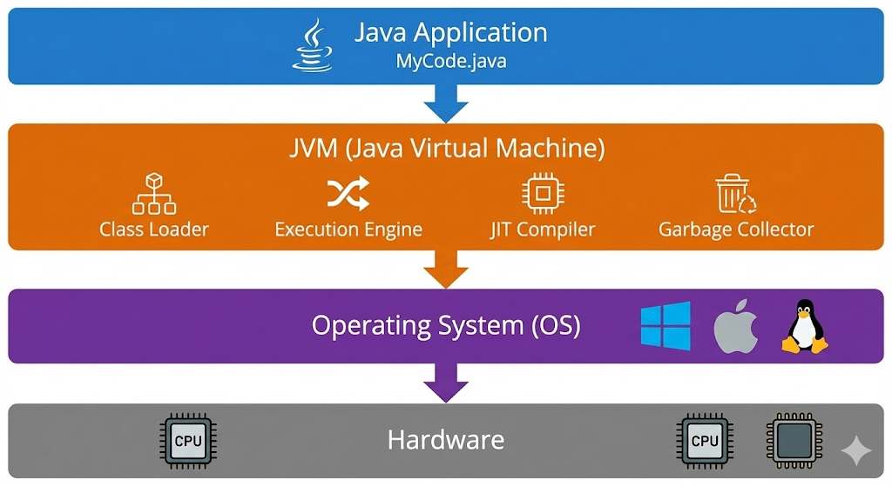
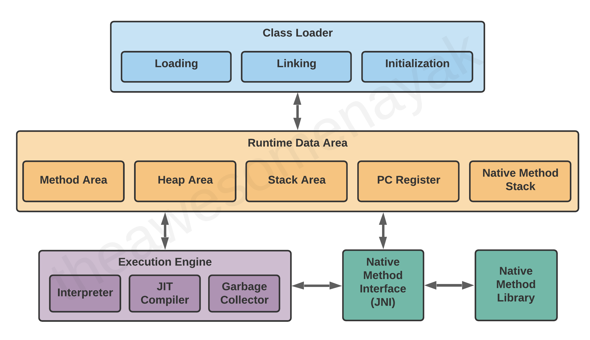
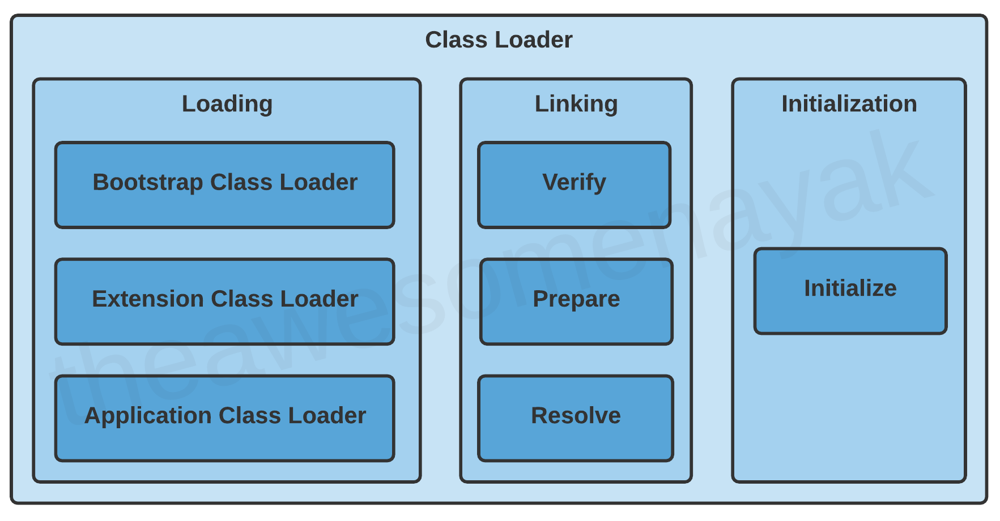
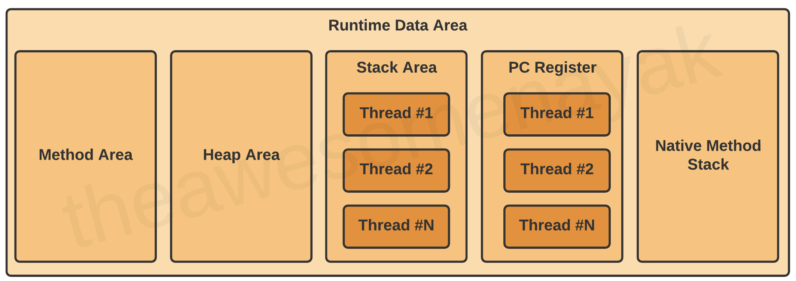
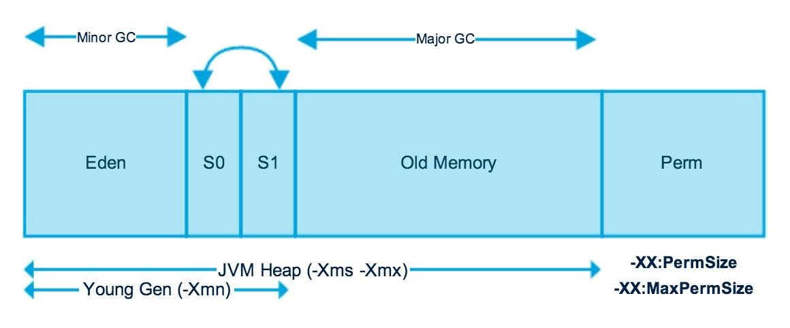

## JVM(Java Virtual Machine)란 무엇일까?



- JVM은 ***자바 프로그램을 실행하기위한 가상 머신***이며, 자바 애플리케이션이 운영체제와 하드웨어에 독립적으로 실행될 수 있도록 한다.
    - 개발자가 .java 파일에 코드를 작성한 이후 .class 파일로 컴파일을 하면, JVM이 해당 바이트코드를 해석하여 운영체제에서 실행할 수 있는 형태로 변환한다.
    - 즉, JVM은 ***자바 프로그램이 다양한 환경에서 동일하게 동작할 수 있도록 중간 매개체 역할***을 한다.
- JVM은 단순히 자바 프로그램을 실행하는 것 외에도 다양한 기능을 제공한다.
    - 자바 바이트코드를 실행
    - 메모리 관리 (메모리 할당 및 해제, 사용 용도에 따른 메모리 구분 등)
    - 운영체제와의 상호 작용 (CPU, 파일 시스템, 네트워크 등)

### JVM은 어떻게 자바를 실행할까?

1. 소스 코드 작성: 개발자가 .java 파일에 자바 코드를 작성한다.
    ```java
    public class HelloWorld {
    
        public static void main(String[] args) {
            System.out.println("Hello, World!");
        }
    }
    ```

2. 컴파일: 자바 컴파일러(javac)가 .java 파일을 바이트코드(.class 파일)로 컴파일한다.
    - 컴파일을 진행하면서 문법적 오류가 있는지 검사를하고, 오류가 없다면 바이트코드로 변환한다.
    ```sh
    javac HelloWorld.java
    ```

3. JVM 실행: OS로부터 자원을 할당받아, JVM이 .class 파일을 로드하고 프로그램 실행 준비를 한다.
    - OS로 부터 메모리를 할당받은 이후 JVM은 필요한 `.class` 파일을 찾아 JVM 메모리 위에 로드한다.
    ```sh
    java HelloWorld
    ```

4. 실행: JVM이 변환된 코드를 실행하며, 운영체제와 상호작용하여 프로그램이 동작하도록 한다.
    - JVM은 바이트코드를 해석하여 기계어로 변환하여 자바 프로그램이 실행되도록 한다.

### 자바 프로그램은 컴파일 언어인가?

- 자바는 ***컴파일 언어이면서 동시에 인터프리터 언어의 특성***을 가지고 있다.
    - 위의 자바 실행 과정에서 볼 수 있듯이, 자바 코드는 먼저 바이트코드로 컴파일된 후, JVM에 의해 실행된다.
    - 이후 JVM은 ***바이트코드를 해석하여 기계어로 변환하여 실행***한다.
- 이러한 특성 덕분에 컴파일 언어와 인터프리터 언어의 장점을 모두 누릴 수 있다.
    - 컴파일 언어의 장점: 빠른 실행 속도, 문법 오류 확인
    - 인터프리터 언어의 장점: 바이트코드라는 중간 단계 덕분에 다양한 플랫폼에서 실행 가능

### 인터프리터의 한계를 극복하기 위한 JIT(Just-In-Time) 컴파일러

- 자바는 인터프리터 언어의 특성을 가지기 때문에, 바이트코드를 실행할 때마다 기계어로 해석하는 과정이 필요하여 실행 속도가 느릴 수 있다.
- 이를 해결하기 위해 JVM은 JIT(Just-In-Time) 컴파일러를 사용한다.
    - JIT 컴파일러는 자주 사용되는 바이트코드 부분을 기계어로 미리 컴파일하여 메모리에 저장해둔다. (캐싱)
    - 이후 동일한 코드가 실행될 때는 JIT 컴파일러가 미리 컴파일된 기계어를 사용하여 실행 속도를 향상시킨다.
- JIT 컴파일러 덕분에 자바 프로그램은 인터프리터 언어의 유연성을 유지하면서도, 컴파일 언어에 가까운 실행 속도를 얻을 수 있다.
  > 자주사용되는 코드를 메모리에 캐싱하는 과정이 추가되기 때문에 단순 실행 및 종료되는 프로그램에서는 오히려 성능이 저하될 수 있다.
- JIT 코드캐시 Size 조정 방법
    - 기계어를 미리 캐싱한다는 의미는 결국 메모리를 추가로 사용한다는 의미이기도 하다. 만약 대규모 애플리케이션이 실행되는 경우, JIT 컴파일러가 생성한 기계어 코드가 메모리를 과도하게 점유할 수 있다.
      때문에 JIT 코드 캐시의 크기를 조정하는 것이 필요할 수 있다.
    - `-XX:InitialCodeCacheSize=<size>` : JVM 시작 시 코드 캐시의 초기 크기를 설정
    - `-XX:ReservedCodeCacheSize=<size>` : JVM이 사용할 수 있는 코드 캐시의 최대 크기를 설정

> https://docs.oracle.com/javase/8/embedded/develop-apps-platforms/codecache.htm

## JVM 아키텍처

- 위에서 간단하게 어떻게 자바 프로그램이 실행이되고, JVM이 어떤 역할을 하는지 간단하게 알아보았다.
- 이번에는 좀더 깊이 들어가서 JVM의 내부 구조와 각 구성 요소가 어떻게 상호작용하는지 살펴보자.



### ClassLoader

)

- `ClassLoader`는 자바 클래스 파일(.class)을 JVM 메모리(Method Area)에 로드하는 역할을 한다.
    - 우리가 Java 런타임 환경에서 `Class` 객체를 반환받을 수 있는 이유도 바로 `ClassLoader` 덕분이다.

#### Dynamic Class Loading

- Java는 컴파일 언어이면서 동시에 인터프리터 언어의 특성을 가지고 있다. 때문에 ***JVM은 런타임 시점에 필요한 클래스 파일(.class)을 동적으로 로드***할 수 있다.
    - 이러한 특성 덕분에 Java 프로그램 시작시 모든 클래스를 미리 로드하지 않고, ***필요한 시점에 클래스를 로드***하게 된다.
    - 클래스는 단 한번만 로드되며, 이후에는 메모리에 로드된 클래스를 재사용한다.
    - 이를 통해 메모리 사용을 최적화하고, 애플리케이션의 유연성을 높일 수 있다.
- 그럼 `ClassLoader`는 어떻게 클래스를 로드하여 JVM이 사용할 수 있도록 할까?
    - 클래스 로딩: 지정된 경로에서 클래스 파일을 찾아 JVM 메모리에 로드한다. (내장 클래스 로더, 사용자 정의 클래스 로더)
    - 클래스 검증: 로드된 클래스 파일이 유효한지 검사하여 보안성을 확보한다.
    - 클래스 연결: 로드된 클래스를 JVM 내부 구조에 연결하여 사용할 수 있도록 한다.
    - 클래스 초기화: 클래스의 static 블록이나 static 변수를 초기화한다.
- 아래 예제는 `UserApplication`이 실행될 때, 커맨드라인 인자가 존재하는 경우에만 `User` 클래스를 동적으로 로드하는 예제이다.

```java
public class UserApplication {

    public static void main(String[] args) {
        System.out.println("UserApplication 실행");

        if (args.length != 0) {
            User user = new User();
        }
        System.out.println("UserApplication 종료");
    }
}
```

```shell
## 클래스 로딩 과정 추적을 위해 -verbose:class 옵션을 사용하여 UserApplication 실행
java -verbose:class -cp build/classes/java/main org.example.jvm.classloader.dynamic.UserApplication

## 결과
UserApplication 실행
UserApplication 종료
[0.049s][info][class,load] java.lang.Shutdown source: shared objects file
[0.049s][info][class,load] java.lang.Shutdown$Lock source: shared objects file 

## 커맨드라인 인자를 추가하여 User 클래스가 동적으로 로드되는 과정 확인
java -verbose:class -cp build/classes/java/main org.example.jvm.classloader.dynamic.UserApplication arg1

## 결과
UserApplication 실행
// User 동적 클래스 로딩 과정
[0.031s][info][class,load] org.example.jvm.classloader.dynamic.User source: file:/Users/yhnoh/git/java/java/build/classes/java/main/
[0.031s][info][class,load] java.lang.invoke.MethodType$1 source: shared objects file
//...
[0.035s][info][class,load] java.lang.invoke.LambdaForm$MH/0x0000000501000400 source: __JVM_LookupDefineClass__
User 인스턴스 생성: org.example.jvm.classloader.dynamic.User@15db9742
UserApplication 종료
[0.035s][info][class,load] java.lang.Shutdown source: shared objects file
[0.035s][info][class,load] java.lang.Shutdown$Lock source: shared objects file
```

- 이러한 동적 로딩의 특성 덕분에 `classpath`에 존재하는 클래스만 로드되는 것 뿐만 아니라, ***사용자 정의 클래스 로더를 통해 네트워크, 데이터베이스 등 다양한 소스에서 클래스를 로드***할 수 있다.
    - 애플리케이션의 유연성과 확장성을 높일 수 있다는 의미이기도 하다.
- Spring Boot의 경우 `jar` 파일 내부에 `BOOT-INF/classes` 및 `BOOT-INF/lib` 디렉토리에 존재하는 클래스들을 로드하기 위해, `LaunchedURLClassLoader`라는
  사용자 정의 클래스 로더를 사용한다.

```shell
## Jar 구조 

example.jar
 |
 +-META-INF
 |  +-MANIFEST.MF
 +-org
 |  +-springframework
 |     +-boot
 |        +-loader
 |           +-<spring boot loader classes>
 +-BOOT-INF
    +-classes
    |  +-mycompany
    |     +-project
    |        +-YourClasses.class
    +-lib
       +-dependency1.jar
       +-dependency2.jar
```

> [Infa > 클래스는 언제 메모리에 로딩 & 초기화 되는가 ❓](https://inpa.tistory.com/entry/JAVA-%E2%98%95-%ED%81%B4%EB%9E%98%EC%8A%A4%EB%8A%94-%EC%96%B8%EC%A0%9C-%EB%A9%94%EB%AA%A8%EB%A6%AC%EC%97%90-%EB%A1%9C%EB%94%A9-%EC%B4%88%EA%B8%B0%ED%99%94-%EB%90%98%EB%8A%94%EA%B0%80-%E2%9D%93) <br/>
> [Spring Boot Docs > Nested JARs](https://docs.spring.io/spring-boot/specification/executable-jar/nested-jars.html)

### Memory



- JVM 메모리는 자바 애플리케이션이 실행되는 동안 필요한 데이터를 저장하고 관리하는 역할을 한다. 이를 효율적으로 관리하기 위해서 JVM 메모리는 여러 영역으로 나누어져 있다.
- 크게는 Heap Area와 Non-Heap Area로 나눌 수 있다.
    - Heap Area: 자바 애플리케이션에서 `new` 연산자로 생성된 객체 또는 배열이 저장되는 공간이다.
    - Non-Heap Area: JVM이 내부적으로 사용하는 메모리 영역으로, Method Area, Stack Area, Program Counter(PC) Registers, Native Method Stacks 등이 포함된다.

#### Method Area / Metaspace

- Method Area는 JVM 메모리의 한 영역으로, ***자바 클래스의 구조와 관련된 정보를 저장하는 공간***이다.
    - 클래스 이름, 접근 제어자, 필드 및 메서드 정보 등이 포함된다.
    - Method Area는 JVM이 클래스를 로드하고 실행할 때 필요한 정보를 제공한다.
    - Method Area는 모든 스레드가 공유하는 영역이기 때문에, 동시성 문제를 방지하기 위해 적절한 동기화 메커니즘이 필요하다.
- 앞에 이야기한 ClassLoader가 로드한 클래스 파일(.class)은 Method Area에 저장된다.
- Java에서 Method Area 영역을 너무 작게 설정하면, 클래스 로딩 시도 시 `java.lang.OutOfMemoryError: Metaspace` 예외가 발생할 수 있다.
- 문제는 Metaspace의 경우 Class에 대한 중요 정보가 저장되는 영역이기 때문에, 이 영역이 부족해지면 새로운 클래스를 로드할 수 없게 되어 애플리케이션이 정상적으로 동작하지 않을 수 있다.
    - 거의 모든 자바 애플리케이션은 런타임 시점에 동적으로 클래스를 로드된 이후에, 애플리케이션 종료 시점에 언로드(unload)되기 때문에 메모리 해제가 자주 일어나지 않는다.
    - 동적 클래스 로딩이 빈번한 애플리케이션에서는 Metaspace 부족 현상이 더 자주 발생할 수 있다.
- 때문에 Metaspace를 모니터링하고, 필요에 따라서 크기를 조정하는 것이 중요하다.
    - `-XX:MetaspaceSize=<size>` : Metaspace의 초기 크기를 설정
    - `-XX:MaxMetaspaceSize=<size>` : Metaspace의 최대 크기를 설정

> [자바 메타스페이스(Metaspace)에 대해 알아보자.](https://jaemunbro.medium.com/java-metaspace%EC%97%90-%EB%8C%80%ED%95%B4-%EC%95%8C%EC%95%84%EB%B3%B4%EC%9E%90-ac363816d35e)

#### Stack Area

- Stack Area는 JVM 메모리의 한 영역으로, 각 ***스레드가 생성될 때마다 할당되는 메모리 공간***이며, ***메서드를 호출하고 실행하는 동안 필요한 데이터를 저장***한다.
    - Stack Area는 각 스레드마다 독립적으로 존재하며, 스레드가 종료되면 해당 스택도 함께 해제된다.
    - 메서드에 필요한 정보인 매개변수, 지역변수, 연산 정보, 반환값 등을 임시로 저장한다.
    - Stack Area는 LIFO(Last In First Out) 구조로 동작하며, 메서드 호출시 스택 프레임이 생성되고, 메서드가 종료되면 해당 스택 프레임이 제거된다. 이로 인해서 메모리 할당과 해제가
      빠르게 이루어진다.
- Stack Area의 크기는 제한되어 있으며, 너무 많은 메서드 호출이나 깊은 재귀 호출이 발생하면 `java.lang.StackOverflowError` 예외가 발생할 수 있다.
- 아래는 Stack Area의 동작 방식을 보여주는 간단한 예제이다.

```java
public class StackAreaMain {

    // methodA -> methodB -> methodC 호출 순서로 출력
    // Stack 영역에 methodA 실행 -> methodB 실행 -> methodC 실행 순서로 스택에 쌓임
    // methodC 종료 -> methodB 종료 -> methodA 종료 순서로 Stack 영역에서 제거됨
    public static void main(String[] args) {

        StackAreaMain stackAreaMain = new StackAreaMain();
        stackAreaMain.methodA();
    }

    public void methodA() {
        System.out.println("StackAreaMain.methodA 호출");
        methodB();
    }

    public void methodB() {
        System.out.println("StackAreaMain.methodB 호출");
        methodC();
    }

    public void methodC() {
        System.out.println("StackAreaMain.methodC 호출");
    }
}
```

#### Heap Area

- Heap Area는 JVM 메모리의 한 영역으로, 자바 애플리케이션에서 ***`new` 연산자로 생성된 객체 또는 배열이 저장되는 공간***이다.
    - 모든 스레드가 공유하는 영역이며, 가비지 컬렉션(GC: Garbage Collection)이라는 메커니즘을 통해 메모리를 동적으로 할당하고 해제한다.
    - 자바에서는 명시적으로 메모리를 해제할 수 없으며, 가비지 컬렉터가 자동으로 사용되지 않는 객체들을 제거하여 메모리 누수를 방지한다.
- Heap Area 중요한 이유는 ***자바의 메모리 영역에서 가장 큰 부분을 차지***하며, 자바에서 ***동적으로 메모리 할당과 해제를 담당하는 가비지 컬렉터가 작동하는 영역***이기 때문이다.
  - 때문에 Heap Area는 애플리케이션의 성능과 안정성에 큰 영향을 미친다.

##### Heap Area 구조

- Heap 영역의 메모리 구조에서 크게 두가지 영역으로 나눌 수 있다.
  - Young Generation: 새로 생성된 객체들이 저장되는 영역이다. Young Generation은 크게 두개의 영역으로 나눌 수 있다.
    - Eden: 새로 생성된 객체들이 처음 할당되는 영역이다.
    - Survivor: Eden에서 GC이후에 살아남은 객체들이 이동하는 영역으로, 두개의 영역으로 구성되어 하나의 영역은 반드시 비어 있어야 한다.
      - 참고로 객체의 크기가 Survivor 영역보다 큰 경우에는 Eden 영역에서 직접 Old Generation 영역으로 이동한다.
  - Old Generation: 장기간 살아남은 객체들이 저장되는 영역이다. Young Generation에서 여러 번의 GC을 거친 객체들이 이 영역으로 이동한다.

##### GC: Garbage Collection
- Heap Area의 구조가 Young Generation과 Old Generation으로 나누어져 있는 이유는 JVM의 가비지 컬렉션(GC)을 효율적으로 사용하기 위해서이다.
  - 만약 Heap 영역이 단일 영역으로 구성되어 있다면, GC이 발생할 때마다 전체 Heap 영역을 검사해야 하기 때문에 성능 저하가 발생할 수 있다.
  - 참고로 ***GC가 발생하게 되는 순간, JVM은 애플리케이션의 실행을 일시 중단(Stop-the-world)*** 시키기 때문에, GC의 효율성은 애플리케이션의 응답성에 큰 영향을 미친다.
- GC는 크게 Minor GC와 Major GC로 나눌 수 있다. 
  - Minor GC: Young Generation에서 발생하는 GC**
    - Minor GC는 Young Generation에서 사용되지 않는 객체들을 제거하고, 살아남은 객체들을 Survivor 영역으로 이동시킨다.
    - Minor GC는 상대적으로 빠르게 수행되며, 애플리케이션의 응답성에 큰 영향을 미치지 않는다. 즉 Yong Generation은 메모리 공간도 작고, GC도 자주 발생하기 때문에 빠르게 수행되는 것이 중요하다.
  - Major GC: Old Generation에서는 발생하는 GC
    - Major GC는 Old Generation에서 사용되지 않는 객체들을 제거한다.
    - Major GC는 상대적으로 오래 걸리며, 애플리케이션의 응답성에 큰 영향을 미칠 수 있다. 즉 Old Generation은 메모리 공간도 크고, GC도 자주 발생하지 않기 때문에 상대적으로 오래 걸린다.

> [Oracle > HotSpot Virtual Machine Garbage Collection Tuning Guide](https://docs.oracle.com/en/java/javase/21/gctuning/introduction-garbage-collection-tuning.html) <br/>
> [Bestol > Java Memory Management for Java Virtual Machine (JVM)](https://www.betsol.com/blog/java-memory-management-for-java-virtual-machine-jvm/)

#### Program Counter (PC) Registers

#### Native Method Stacks

> [Infa > JVM 내부 구조 & 메모리 영역 💯 총정리](./https://inpa.tistory.com/entry/JAVA-%E2%98%95-JVM-%EB%82%B4%EB%B6%80-%EA%B5%AC%EC%A1%B0-%EB%A9%94%EB%AA%A8%EB%A6%AC-%EC%98%81%EC%97%AD-%EC%8B%AC%ED%99%94%ED%8E%B8#%EB%9F%B0%ED%83%80%EC%9E%84_%EB%8D%B0%EC%9D%B4%ED%84%B0_%EC%98%81%EC%97%AD_runtime_data_area)

> https://docs.oracle.com/javase/specs/jls/se21/html/jls-12.html
> https://brewagebear.github.io/fundamental-jvm-classloader/
> https://parkadd.tistory.com/112
> https://catsbi.oopy.io/df0df290-9188-45c1-b056-b8fe032d88ca
> https://www.geeksforgeeks.org/java/how-jvm-works-jvm-architecture/
> https://www.freecodecamp.org/news/jvm-tutorial-java-virtual-machine-architecture-explained-for-beginners/