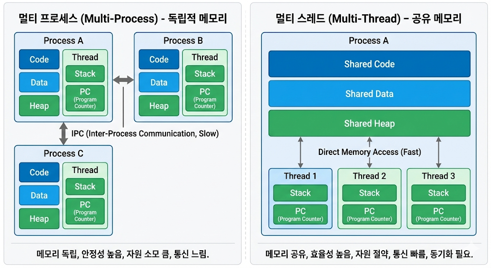

## 멀티 스레드 (Multi-Thread)란?


- 스레드란 프로새스 내에서 실행되는 작은 실행 단위를 의미한다. 그리고 멀티 스레드는 ***하나의 프로세스에서 여러 개의 스레드를 동시에 실행하는 것***을 의미한다.
- 웹 서버를 떠올려 보면 하나의 웹 서버(프로세스)가 여러 사용자의 요청(스레드)를 동시에 처리하는 것을 알 수 있다. 만약 싱글 스레드로 구현되어 있다면, 웹 서버는 한 번에 하나의 요청만 처리할 수 있어 매우 비효율적일 것이다.

### 멀티 스레드가 등장한 이유는?
- 초기 프로그램은 입력을 받아 처리하고 결과를 출력하는 단순한 구조였다. 이로 인해서 ***I/O 작업이 발생하면 CPU는 아무 일도 하지 못하고 대기한 이후에 결과를 출력하는 방식***이었다.
  - 즉 CPU가 I/O 작업이 끝날 때까지 놀고 있는 시간이 많았다. 이는 ***자원을 효율적으로 사용하지 못하는 문제를 야기***했다.


- 이를 해결하기 위하여 멀티 프로세스와 멀티 스레드가 등장하게 되었다. 멀티 스레드와 멀티 프로세스 모두 병렬적으로 작업을 처리할 수 있도록 하여 ***CPU의 유휴 시간을 줄이고, 자원을 효율적으로 사용***할 수 있도록 한다.
  - 특히 공유 자원(ex: 데이터베이스, 파일)을 사용하는 프로그램의 경우, 멀티 프로세스 및 멀티 스레드를 통해 자원을 효율적으로 사용할 수 있다.
- 특히 멀티 스레드가 웹 서버와 같은 I/O 작업이 빈번하며, 자원의 공유가 잦고 요청이 잦은 경우에 더욱 유리하다.
    - 메모리 공유로 인한 효율적 자원 사용: 멀티 스레드는 같은 프로세스 내에서 메모리를 공유하기 때문에 적은 메모리를 사용하고, 스레드 간의 자원 공유가 쉽고 빠르다. 반면 멀티 프로세스는 각 프로세스가 독립적인 메모리 공간을 가지기 때문에 많은 메모리를 사용하고. 자원 공유를 위해서는 별도의 통신 메커니즘이 필요하다. 
    - Context Switching 비용이 낮음: 멀티 스레드는 프로세스 내에서 스레드 간의 전환이 이루어지기 때문에, 컨텍스트 스위칭 오버헤드가 적다. 반면 멀티 프로세스는 각 프로세스 간의 전환이 이루어지기 때문에, 컨텍스트 스위칭 오버헤드가 크다.
    - 요청 처리 속도 빠름: 멀티 스레드는 같은 프로세스 내에서 스레드 간의 통신이 빠르기 때문에, 요청 처리 속도가 빠르다. 반면 멀티 프로세스는 각 프로세스 간의 통신이 느리기 때문에, 요청 처리 속도가 느리다.

## 멀티 스레드 사용시 주의해야할 사항
- 멀티 스레드는 메모리를 공유하기 때문에 공유 자원에 대한 접근이 쉽지만, 이로 인해서 여러 스레드가 동시에 동일한 자원에 접근하게 될 경우 ***데이터 일관성 문제가 발생할 수 있다.***

### 데이터 일관성 문제 일으키기
- 아래 예제는 100개의 스레드가 동시에 하나의 카운트를 증가시키는 코드이다. 100이라는 기대값을 얻어야 하지만, 실행때마다 다른 결과가 출력되는 것을 볼 수 있다.
- 이는 여러 스레드가 동시에 count 변수에 접근하여 값을 변경하면서 발생하는 데이터 일관성 문제 때문이다.
```java
public class CounterMain {

    static class Counter {
        private int count = 0;

        public void increment() {
            count++;
        }

        public int getCount() {
            return count;
        }
    }

    public static void main(String[] args) throws InterruptedException {

        // 공유 자원
        Counter counter = new Counter();

        // 100개의 스레드 생성
        int threadCount = 100;
        Thread[] threads = new Thread[threadCount];

        for (int i = 0; i < threadCount; i++) {

            threads[i] = new Thread(() -> {
                // 각 스레드는 카운트를 1 증가
                try {
                    sleep(10);
                    counter.increment();
                } catch (InterruptedException e) {
                    throw new RuntimeException(e);
                }
            });
        }

        // 모든 스레드 시작
        for (int i = 0; i < threadCount; i++) {
            threads[i].start();
        }

        // 모든 스레드가 종료될 때까지 대기
        for (int i = 0; i < threadCount; i++) {
            threads[i].join();
        }

        // 최종 카운트 출력: count = 88
        System.out.println("count = " + counter.getCount());

    }
}
```

- 해당 Counter 클래스의 increment() 메서드는 내부적으로 count 변수를 1 증가시키는 역할을 한다. 하지만 여러 스레드가 동시에 increment() 메서드를 호출하게 되면, 다음과 같은 상황이 발생하여 데이터 일관성 문제가 발생하게 된다.
  1. 스레드 A가 count 값을 읽음 (예: count = 0)
  2. 스레드 B가 count 값을 읽음 (예: count = 0)
  3. 스레드 A가 count 값을 1 증가시킴 (count = 1)
  4. 스레드 B가 count 값을 1 증가시킴 (count = 1)


### 데이터 일관성 문제 해결하기
- 데이터 일관성 문제를 해결하기 위해서는 ***동기화(Synchronization)***를 사용하여 여러 스레드가 동시에 동일한 자원에 접근하지 못하도록 해야 한다.
- 동기화는 자바에서 `synchronized` 키워드를 사용하여 구현할 수 있다. `synchronized` 키워드를 사용하면, 해당 메서드나 블록에 대해 ***한 번에 하나의 스레드만 접근할 수 있도록 제한***할 수 있다.


> [Infa > 멀티 프로세스 vs 멀티 스레드 비교 💯 완전 총정리](https://inpa.tistory.com/entry/%F0%9F%91%A9%E2%80%8D%F0%9F%92%BB-multi-process-multi-thread)
